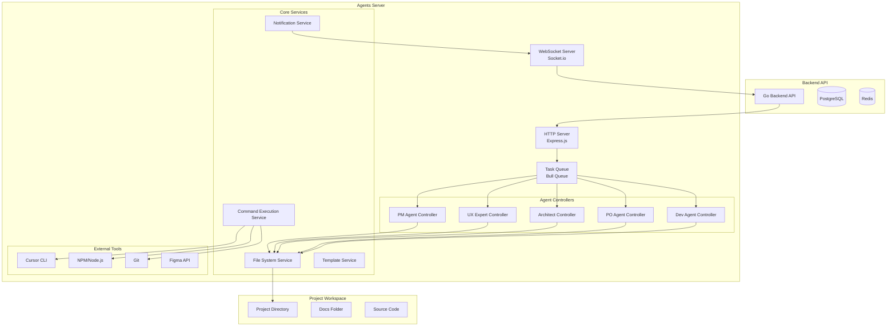
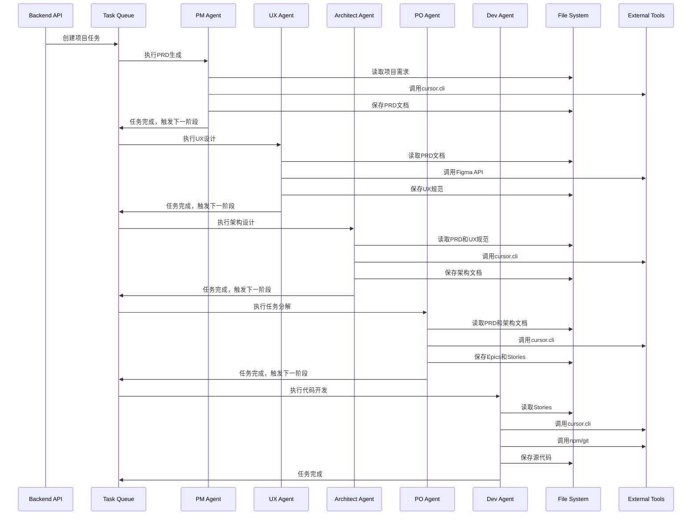
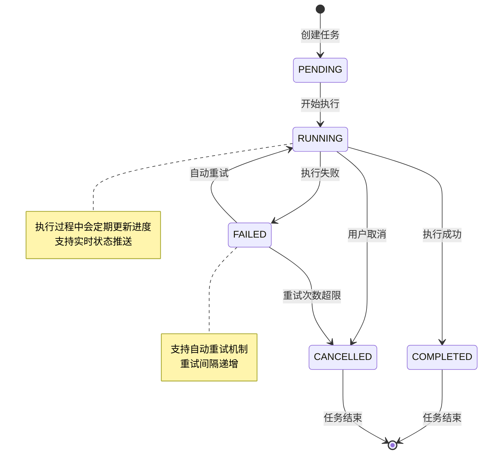
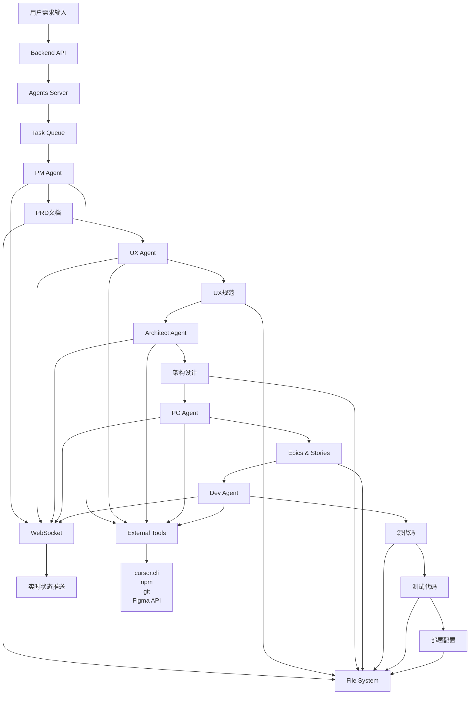

# Agents Server - BMad-Method 多Agent协作开发服务

## 概述

Agents Server 是基于 Node.js 的多Agent协作开发服务，作为 AutoCodeWeb 平台的核心组件，负责执行 BMad-Method 标准流程中的各个Agent角色任务。该服务通过 HTTP API 与后端系统通信，实现项目开发流程的自动化执行。

## 技术选型

### 核心框架
- **Express.js**: 轻量级、高性能的 Web 框架
- **TypeScript**: 提供类型安全和更好的开发体验
- **Bull Queue**: Redis 基础的任务队列，支持任务调度和重试
- **Socket.io**: 实时双向通信，用于任务状态推送

### 依赖管理
- **pnpm**: 高效的包管理器
- **ts-node**: TypeScript 运行时支持
- **nodemon**: 开发环境热重载

### 工具集成
- **child_process**: 执行系统命令（cursor.cli, npm, git等）
- **fs-extra**: 增强的文件系统操作
- **axios**: HTTP 客户端，用于与后端API通信
- **winston**: 结构化日志记录

## 系统架构

### 整体架构图



### 核心组件设计

#### 1. HTTP Server (Express.js)
```typescript
interface ServerConfig {
  port: number;
  cors: CorsOptions;
  rateLimit: RateLimitOptions;
  auth: AuthConfig;
}

interface AgentRequest {
  projectId: string;
  userId: string;
  stage: DevStage;
  context: ProjectContext;
  parameters: Record<string, any>;
}
```

#### 2. Task Queue System (Bull Queue)
```typescript
interface TaskQueue {
  // 队列类型
  queues: {
    pm: Queue<PMTask>;
    ux: Queue<UXTask>;
    architect: Queue<ArchitectTask>;
    po: Queue<POTask>;
    dev: Queue<DevTask>;
  };
  
  // 任务处理器
  processors: {
    processPMTask: (job: Job<PMTask>) => Promise<void>;
    processUXTask: (job: Job<UXTask>) => Promise<void>;
    processArchitectTask: (job: Job<ArchitectTask>) => Promise<void>;
    processPOTask: (job: Job<POTask>) => Promise<void>;
    processDevTask: (job: Job<DevTask>) => Promise<void>;
  };
}
```

#### 3. Agent Controllers
```typescript
interface AgentController {
  // 基础接口
  execute(context: ProjectContext): Promise<AgentResult>;
  validate(context: ProjectContext): Promise<ValidationResult>;
  rollback(context: ProjectContext): Promise<void>;
  
  // 状态管理
  getStatus(taskId: string): Promise<TaskStatus>;
  updateProgress(taskId: string, progress: number): Promise<void>;
}

// PM Agent 专用接口
interface PMAgentController extends AgentController {
  generatePRD(requirements: string): Promise<PRDDocument>;
  clarifyRequirements(questions: Question[]): Promise<ClarificationResult>;
}

// UX Expert Agent 专用接口
interface UXAgentController extends AgentController {
  generateUXSpec(prd: PRDDocument, figmaUrl?: string): Promise<UXSpecification>;
  createDesignSystem(uxSpec: UXSpecification): Promise<DesignSystem>;
}

// Architect Agent 专用接口
interface ArchitectAgentController extends AgentController {
  designArchitecture(prd: PRDDocument, uxSpec: UXSpecification): Promise<ArchitectureDesign>;
  selectTechStack(requirements: string): Promise<TechStack>;
}

// PO Agent 专用接口
interface POAgentController extends AgentController {
  createEpics(prd: PRDDocument, architecture: ArchitectureDesign): Promise<Epic[]>;
  createStories(epics: Epic[]): Promise<Story[]>;
}

// Dev Agent 专用接口
interface DevAgentController extends AgentController {
  implementStory(story: Story, context: ProjectContext): Promise<ImplementationResult>;
  runTests(projectPath: string): Promise<TestResult>;
  fixBugs(bugReport: BugReport): Promise<FixResult>;
}
```

#### 4. Core Services
```typescript
// 文件系统服务
interface FileSystemService {
  readFile(path: string): Promise<string>;
  writeFile(path: string, content: string): Promise<void>;
  createDirectory(path: string): Promise<void>;
  copyTemplate(templatePath: string, targetPath: string): Promise<void>;
  replacePlaceholders(filePath: string, variables: Record<string, string>): Promise<void>;
}

// 命令执行服务
interface CommandExecutionService {
  executeCommand(command: string, options: ExecOptions): Promise<ExecResult>;
  executeCursorCommand(projectPath: string, message: string): Promise<string>;
  executeNPMCommand(command: string, projectPath: string): Promise<string>;
  executeGitCommand(command: string, projectPath: string): Promise<string>;
}

// 模板服务
interface TemplateService {
  loadTemplate(templateName: string): Promise<Template>;
  renderTemplate(template: Template, variables: Record<string, any>): Promise<string>;
  saveDocument(path: string, content: string, format: DocumentFormat): Promise<void>;
}

// 通知服务
interface NotificationService {
  notifyBackend(event: NotificationEvent): Promise<void>;
  broadcastProgress(projectId: string, progress: ProgressUpdate): Promise<void>;
  sendErrorAlert(error: Error, context: ErrorContext): Promise<void>;
}
```

## API 接口设计

### REST API 端点

#### 1. 任务管理
```typescript
// 启动Agent任务
POST /api/v1/agents/execute
{
  "projectId": "string",
  "userId": "string", 
  "agentType": "pm" | "ux" | "architect" | "po" | "dev",
  "stage": "string",
  "context": {
    "projectPath": "string",
    "requirements": "string",
    "dependencies": ["string"]
  },
  "parameters": {}
}

// 获取任务状态
GET /api/v1/agents/tasks/{taskId}

// 取消任务
DELETE /api/v1/agents/tasks/{taskId}

// 获取项目所有任务
GET /api/v1/agents/projects/{projectId}/tasks
```

#### 2. Agent 专用接口
```typescript
// PM Agent - 生成PRD
POST /api/v1/agents/pm/generate-prd
{
  "projectId": "string",
  "requirements": "string",
  "clarifications": ["string"]
}

// UX Agent - 生成UX规范
POST /api/v1/agents/ux/generate-spec
{
  "projectId": "string",
  "prdDocument": "string",
  "figmaUrl": "string"
}

// Architect Agent - 设计架构
POST /api/v1/agents/architect/design
{
  "projectId": "string",
  "prdDocument": "string",
  "uxSpecification": "string"
}

// PO Agent - 创建Epics和Stories
POST /api/v1/agents/po/create-epics-stories
{
  "projectId": "string",
  "prdDocument": "string",
  "architectureDesign": "string"
}

// Dev Agent - 实现Story
POST /api/v1/agents/dev/implement-story
{
  "projectId": "string",
  "storyId": "string",
  "story": {}
}
```

### WebSocket 事件

```typescript
// 连接事件
interface SocketEvents {
  // 客户端连接
  'connect': () => void;
  
  // 任务进度更新
  'task:progress': (data: {
    taskId: string;
    projectId: string;
    progress: number;
    message: string;
    stage: string;
  }) => void;
  
  // 任务完成
  'task:completed': (data: {
    taskId: string;
    projectId: string;
    result: any;
    artifacts: string[];
  }) => void;
  
  // 任务失败
  'task:failed': (data: {
    taskId: string;
    projectId: string;
    error: string;
    retryable: boolean;
  }) => void;
  
  // Agent状态更新
  'agent:status': (data: {
    agentType: string;
    status: 'idle' | 'busy' | 'error';
    currentTask?: string;
  }) => void;
}
```

## 数据模型设计

### 核心数据模型

```typescript
// 项目上下文
interface ProjectContext {
  projectId: string;
  userId: string;
  projectPath: string;
  projectName: string;
  requirements: string;
  status: ProjectStatus;
  currentStage: DevStage;
  artifacts: ProjectArtifact[];
  dependencies: string[];
}

// 任务模型
interface AgentTask {
  id: string;
  projectId: string;
  userId: string;
  agentType: AgentType;
  stage: DevStage;
  status: TaskStatus;
  progress: number;
  parameters: Record<string, any>;
  context: ProjectContext;
  createdAt: Date;
  startedAt?: Date;
  completedAt?: Date;
  error?: string;
  result?: any;
}

// Agent结果
interface AgentResult {
  success: boolean;
  artifacts: ProjectArtifact[];
  nextStage?: DevStage;
  dependencies?: string[];
  error?: string;
  metadata: Record<string, any>;
}

// 项目工件
interface ProjectArtifact {
  id: string;
  type: ArtifactType;
  name: string;
  path: string;
  content: string;
  format: DocumentFormat;
  createdAt: Date;
  updatedAt: Date;
}

// 枚举类型
enum AgentType {
  PM = 'pm',
  UX = 'ux', 
  ARCHITECT = 'architect',
  PO = 'po',
  DEV = 'dev'
}

enum DevStage {
  PRD_GENERATING = 'prd_generating',
  UX_DEFINING = 'ux_defining',
  ARCH_DESIGNING = 'arch_designing',
  DATA_MODELING = 'data_modeling',
  API_DEFINING = 'api_defining',
  EPIC_PLANNING = 'epic_planning',
  STORY_DEVELOPING = 'story_developing',
  BUG_FIXING = 'bug_fixing',
  TESTING = 'testing',
  PACKAGING = 'packaging'
}

enum TaskStatus {
  PENDING = 'pending',
  RUNNING = 'running',
  COMPLETED = 'completed',
  FAILED = 'failed',
  CANCELLED = 'cancelled'
}

enum ArtifactType {
  PRD = 'prd',
  UX_SPEC = 'ux_spec',
  ARCHITECTURE = 'architecture',
  DATA_MODEL = 'data_model',
  API_SPEC = 'api_spec',
  EPICS = 'epics',
  STORIES = 'stories',
  SOURCE_CODE = 'source_code',
  TESTS = 'tests',
  DOCUMENTATION = 'documentation'
}

enum DocumentFormat {
  MARKDOWN = 'markdown',
  JSON = 'json',
  YAML = 'yaml',
  XML = 'xml',
  TEXT = 'text'
}
```

## 本地部署架构

### 系统要求

- **操作系统**: Windows 10/11
- **Node.js**: >= 18.0.0
- **GPU**: 支持CUDA的NVIDIA显卡（用于AI模型加速）
- **内存**: >= 8GB RAM
- **存储**: >= 10GB 可用空间

### 环境配置

```batch
REM 环境变量配置 (.env)
NODE_ENV=development
PORT=3001
REDIS_URL=redis://localhost:6379
BACKEND_API_URL=http://localhost:8080
PROJECT_DATA_PATH=F:/app-maker/app_data/projects
LOG_LEVEL=info

REM GPU配置
CUDA_VISIBLE_DEVICES=0
CUDA_MEMORY_FRACTION=0.8

REM AI工具配置
CURSOR_CLI_PATH=C:\Program Files\Cursor\cursor.exe
NPM_PATH=C:\Program Files\nodejs\npm.cmd
GIT_PATH=C:\Program Files\Git\bin\git.exe
```

**注意**: Redis服务由后端容器提供，已映射到主机的6379端口，无需单独安装。

### 本地安装步骤

```batch
REM 1. 安装Node.js和pnpm
REM 下载并安装Node.js: https://nodejs.org/
REM 安装pnpm:
npm install -g pnpm

REM 2. 安装AI开发工具
REM 安装cursor.cli
npm install -g @cursor/cli

REM 3. 安装项目依赖
cd F:\AI\app-maker\agents-server
pnpm install

REM 4. 构建项目
pnpm build

REM 5. 启动服务
pnpm start
```

### 目录结构

```
F:\AI\app-maker\              # 代码目录
├── agents-server\            # Agents Server源码
│   ├── src\
│   ├── templates\
│   └── package.json
├── backend\                  # Go Backend源码
├── frontend\                 # Vue.js Frontend源码
└── docs\                     # 文档

F:\app-maker\                 # 数据目录（运行时挂载）
├── app_data\                 # 项目数据目录
│   ├── projects\            # 项目文件
│   ├── templates\            # 模板文件
│   └── cache\               # 缓存文件
└── logs\                     # 日志文件
    ├── agents-server.log
    └── task.log
```

## 启动脚本

### Windows启动脚本 (start.bat)

```batch
@echo off
echo Starting Agents Server...

REM 设置环境变量
set NODE_ENV=development
set PORT=3001
set REDIS_URL=redis://localhost:6379
set BACKEND_API_URL=http://localhost:8080
set PROJECT_DATA_PATH=F:/app-maker/app_data/projects

REM 启动Agents Server（在代码目录中运行）
cd /d F:\AI\app-maker\agents-server
pnpm start

pause
```

### 进程管理

```batch
REM 查看进程状态
tasklist | findstr node

REM 停止服务
taskkill /f /im node.exe

REM 重启服务
taskkill /f /im node.exe && pnpm start
```

## 开发指南

### 项目结构

```
agents-server/
├── src/
│   ├── controllers/          # Agent控制器
│   │   ├── pm.controller.ts
│   │   ├── ux.controller.ts
│   │   ├── architect.controller.ts
│   │   ├── po.controller.ts
│   │   └── dev.controller.ts
│   ├── services/             # 核心服务
│   │   ├── file-system.service.ts
│   │   ├── command-execution.service.ts
│   │   ├── template.service.ts
│   │   └── notification.service.ts
│   ├── queues/               # 任务队列
│   │   ├── pm.queue.ts
│   │   ├── ux.queue.ts
│   │   ├── architect.queue.ts
│   │   ├── po.queue.ts
│   │   └── dev.queue.ts
│   ├── models/               # 数据模型
│   │   ├── project.model.ts
│   │   ├── task.model.ts
│   │   └── artifact.model.ts
│   ├── utils/                # 工具函数
│   │   ├── logger.util.ts
│   │   └── validator.util.ts
│   ├── routes/               # 路由
│   │   └── agent.routes.ts
│   ├── config/               # 配置
│   │   ├── redis.config.ts
│   │   └── app.config.ts
│   ├── app.ts                # 应用入口
│   └── server.ts             # 服务器启动
├── templates/                # 模板文件
│   ├── prd.template.md
│   ├── ux-spec.template.md
│   ├── architecture.template.md
│   └── story.template.md
├── package.json
├── tsconfig.json
├── .env.example
└── README.md
```

### 开发命令

```batch
REM 安装依赖
pnpm install

REM 开发模式（热重载）
pnpm dev

REM 构建TypeScript
pnpm build

REM 启动生产服务
pnpm start

REM 查看日志
type F:\app-maker\logs\agents-server.log

REM 清理缓存
rmdir /s /q node_modules\.cache
```

## 关键UML设计图

### 1. Agent协作流程图



### 2. 系统组件关系图

```mermaid
classDiagram
    class AgentController {
        <<interface>>
        +execute(context: ProjectContext): Promise~AgentResult~
        +validate(context: ProjectContext): Promise~ValidationResult~
        +rollback(context: ProjectContext): Promise~void~
        +getStatus(taskId: string): Promise~TaskStatus~
        +updateProgress(taskId: string, progress: number): Promise~void~
    }
    
    class PMAgentController {
        +generatePRD(requirements: string): Promise~PRDDocument~
        +clarifyRequirements(questions: Question[]): Promise~ClarificationResult~
    }
    
    class UXAgentController {
        +generateUXSpec(prd: PRDDocument, figmaUrl?: string): Promise~UXSpecification~
        +createDesignSystem(uxSpec: UXSpecification): Promise~DesignSystem~
    }
    
    class ArchitectAgentController {
        +designArchitecture(prd: PRDDocument, uxSpec: UXSpecification): Promise~ArchitectureDesign~
        +selectTechStack(requirements: string): Promise~TechStack~
    }
    
    class POAgentController {
        +createEpics(prd: PRDDocument, architecture: ArchitectureDesign): Promise~Epic[]~
        +createStories(epics: Epic[]): Promise~Story[]~
    }
    
    class DevAgentController {
        +implementStory(story: Story, context: ProjectContext): Promise~ImplementationResult~
        +runTests(projectPath: string): Promise~TestResult~
        +fixBugs(bugReport: BugReport): Promise~FixResult~
    }
    
    class FileSystemService {
        +readFile(path: string): Promise~string~
        +writeFile(path: string, content: string): Promise~void~
        +createDirectory(path: string): Promise~void~
        +copyTemplate(templatePath: string, targetPath: string): Promise~void~
        +replacePlaceholders(filePath: string, variables: Record~string, string~): Promise~void~
    }
    
    class CommandExecutionService {
        +executeCommand(command: string, options: ExecOptions): Promise~ExecResult~
        +executeCursorCommand(projectPath: string, message: string): Promise~string~
        +executeNPMCommand(command: string, projectPath: string): Promise~string~
        +executeGitCommand(command: string, projectPath: string): Promise~string~
    }
    
    class TemplateService {
        +loadTemplate(templateName: string): Promise~Template~
        +renderTemplate(template: Template, variables: Record~string, any~): Promise~string~
        +saveDocument(path: string, content: string, format: DocumentFormat): Promise~void~
    }
    
    class NotificationService {
        +notifyBackend(event: NotificationEvent): Promise~void~
        +broadcastProgress(projectId: string, progress: ProgressUpdate): Promise~void~
        +sendErrorAlert(error: Error, context: ErrorContext): Promise~void~
    }
    
    AgentController <|-- PMAgentController
    AgentController <|-- UXAgentController
    AgentController <|-- ArchitectAgentController
    AgentController <|-- POAgentController
    AgentController <|-- DevAgentController
    
    PMAgentController --> FileSystemService
    UXAgentController --> FileSystemService
    ArchitectAgentController --> FileSystemService
    POAgentController --> FileSystemService
    DevAgentController --> FileSystemService
    
    PMAgentController --> CommandExecutionService
    UXAgentController --> CommandExecutionService
    ArchitectAgentController --> CommandExecutionService
    POAgentController --> CommandExecutionService
    DevAgentController --> CommandExecutionService
    
    PMAgentController --> TemplateService
    UXAgentController --> TemplateService
    ArchitectAgentController --> TemplateService
    POAgentController --> TemplateService
    DevAgentController --> TemplateService
    
    PMAgentController --> NotificationService
    UXAgentController --> NotificationService
    ArchitectAgentController --> NotificationService
    POAgentController --> NotificationService
    DevAgentController --> NotificationService
```



### 3. 任务队列状态机图



### 4. 数据流图



## 总结

Agents Server 作为 AutoCodeWeb 平台的核心组件，通过标准化的 Agent 协作流程，实现了项目开发的自动化。该架构设计具有以下特点：

1. **模块化设计**: 每个Agent角色独立实现，便于维护和扩展
2. **异步处理**: 基于队列的任务处理，支持高并发和容错
3. **实时通信**: WebSocket支持实时状态更新和进度反馈
4. **工具集成**: 无缝集成cursor.cli、npm、git等开发工具
5. **可扩展性**: 支持新Agent角色的快速添加
6. **本地部署**: 直接运行在主机上，支持GPU加速和文件系统访问
7. **简化配置**: 去除复杂的容器化和监控配置，专注核心功能

该架构为后续的开发工程师提供了清晰的实现指导，确保系统能够稳定、高效地运行。

## 技术选型说明

### 为什么选择 Express.js？
- **轻量级**: 相比 NestJS，Express.js 更轻量，适合快速开发
- **灵活性**: 中间件机制灵活，便于集成各种功能
- **生态成熟**: 丰富的中间件和插件生态
- **学习成本低**: 团队更容易上手和维护

### 为什么选择 Bull Queue？
- **Redis基础**: 利用现有Redis基础设施
- **可靠性**: 支持任务持久化和重试机制
- **简单易用**: 配置简单，易于调试
- **扩展性**: 支持多进程和分布式部署

### 为什么选择 Socket.io？
- **实时性**: 支持双向实时通信
- **兼容性**: 自动降级到轮询，兼容性更好
- **房间管理**: 支持按项目ID分组推送
- **断线重连**: 自动处理网络中断和重连

### 为什么选择 TypeScript？
- **类型安全**: 减少运行时错误
- **开发体验**: 更好的IDE支持和代码提示
- **维护性**: 大型项目更容易维护
- **团队协作**: 接口定义清晰，便于团队协作

## 与现有Backend的集成

### API调用流程
```
Backend API (Go) 
    ↓ HTTP POST
Agents Server (Node.js)
    ↓ 任务队列
Agent Controllers
    ↓ 文件操作/命令执行
Project Workspace
    ↓ WebSocket推送
Backend API (状态更新)
```

### 数据同步机制
1. **项目创建**: Backend创建项目后，调用Agents Server启动开发流程
2. **状态同步**: Agents Server通过WebSocket实时推送任务状态
3. **文档生成**: 各Agent生成的文档保存到项目目录，Backend通过文件系统访问
4. **错误处理**: Agents Server将错误信息推送给Backend，触发相应的错误处理流程

### 部署协调
- **本地服务**: 直接运行在主机上，无需容器化
- **文件系统**: 直接访问主机文件系统，支持GPU加速
- **进程管理**: 使用系统进程管理，支持后台运行
- **配置管理**: 通过环境变量和配置文件管理
