# Agents Server Architecture Document

## 概述

Agents Server 是基于 Node.js + TypeScript 的多Agent协作开发服务，采用自定义实现 + MCP SDK 混合方案。该服务作为 AutoCodeWeb 平台的核心组件，负责执行 BMad-Method 标准流程中的各个Agent角色任务，通过标准化的Agent协作流程实现项目开发的自动化。

## 技术架构

### 整体架构图

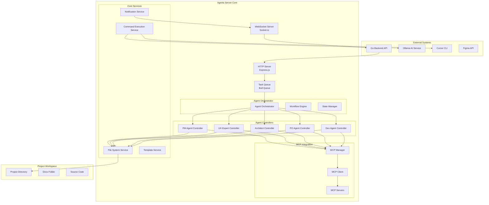

## 核心组件设计

### 1. Agent Orchestrator (编排器)

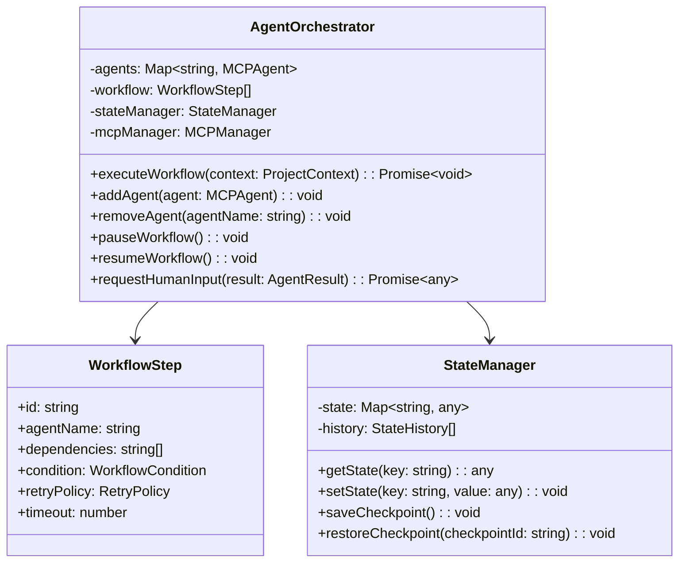

### 2. MCP Integration Layer

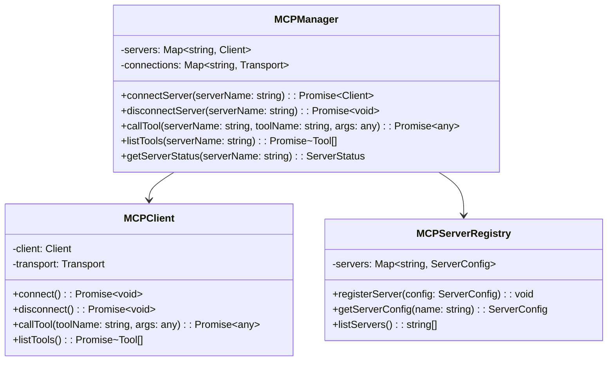

### 3. Agent Base Classes

```mermaid
classDiagram
    class MCPAgent {
        <<abstract>>
        #name: string
        #instruction: string
        #serverNames: string[]
        #functions: AgentFunction[]
        #mcpManager: MCPManager
        +execute(context: ProjectContext): Promise~AgentResult~
        +validate(context: ProjectContext): Promise~ValidationResult~
        +rollback(context: ProjectContext): Promise~void~
        #callTool(serverName: string, toolName: string, args: any): Promise~any~
        #updateProgress(progress: number): void
        #requestHumanInput(message: string): Promise~any~
    }
    
    class PMAgent {
        +generatePRD(requirements: string): Promise~PRDDocument~
        +clarifyRequirements(questions: Question[]): Promise~ClarificationResult~
        +validateRequirements(prd: PRDDocument): Promise~ValidationResult~
    }
    
    class UXAgent {
        +generateUXSpec(prd: PRDDocument, figmaUrl?: string): Promise~UXSpecification~
        +createDesignSystem(uxSpec: UXSpecification): Promise~DesignSystem~
        +generatePageDesigns(uxSpec: UXSpecification): Promise~PageDesign[]
    }
    
    class ArchitectAgent {
        +designArchitecture(prd: PRDDocument, uxSpec: UXSpecification): Promise~ArchitectureDesign~
        +selectTechStack(requirements: string): Promise~TechStack~
        +designAPIs(architecture: ArchitectureDesign): Promise~APISpecification~
        +designDatabase(architecture: ArchitectureDesign): Promise~DatabaseSchema~
    }
    
    class POAgent {
        +createEpics(prd: PRDDocument, architecture: ArchitectureDesign): Promise~Epic[]
        +createStories(epics: Epic[]): Promise~Story[]
        +prioritizeStories(stories: Story[]): Promise~Story[]
    }
    
    class DevAgent {
        +implementStory(story: Story, context: ProjectContext): Promise~ImplementationResult~
        +runTests(projectPath: string): Promise~TestResult~
        +fixBugs(bugReport: BugReport): Promise~FixResult~
        +deployProject(projectPath: string): Promise~DeploymentResult~
    }
    
    MCPAgent <|-- PMAgent
    MCPAgent <|-- UXAgent
    MCPAgent <|-- ArchitectAgent
    MCPAgent <|-- POAgent
    MCPAgent <|-- DevAgent
```

## 数据模型设计

### 核心数据模型

```typescript
// 项目上下文
interface ProjectContext {
  projectId: string;
  userId: string;
  projectPath: string;
  projectName: string;
  requirements: string;
  status: ProjectStatus;
  currentStage: DevStage;
  artifacts: ProjectArtifact[];
  dependencies: string[];
  metadata: Record<string, any>;
}

// Agent任务
interface AgentTask {
  id: string;
  projectId: string;
  userId: string;
  agentType: AgentType;
  stage: DevStage;
  status: TaskStatus;
  progress: number;
  parameters: Record<string, any>;
  context: ProjectContext;
  createdAt: Date;
  startedAt?: Date;
  completedAt?: Date;
  error?: string;
  result?: any;
  retryCount: number;
  maxRetries: number;
}

// Agent结果
interface AgentResult {
  success: boolean;
  artifacts: ProjectArtifact[];
  nextStage?: DevStage;
  dependencies?: string[];
  error?: string;
  metadata: Record<string, any>;
  requiresHumanInput?: boolean;
  humanInputMessage?: string;
}

// 项目工件
interface ProjectArtifact {
  id: string;
  type: ArtifactType;
  name: string;
  path: string;
  content: string;
  format: DocumentFormat;
  createdAt: Date;
  updatedAt: Date;
  version: number;
  dependencies: string[];
}

// 工作流步骤
interface WorkflowStep {
  id: string;
  agentName: string;
  dependencies: string[];
  condition?: WorkflowCondition;
  retryPolicy: RetryPolicy;
  timeout: number;
  parallel: boolean;
}

// 重试策略
interface RetryPolicy {
  maxRetries: number;
  retryDelay: number;
  backoffMultiplier: number;
  retryableErrors: string[];
}
```

## 关键流程设计

### 1. Agent协作流程

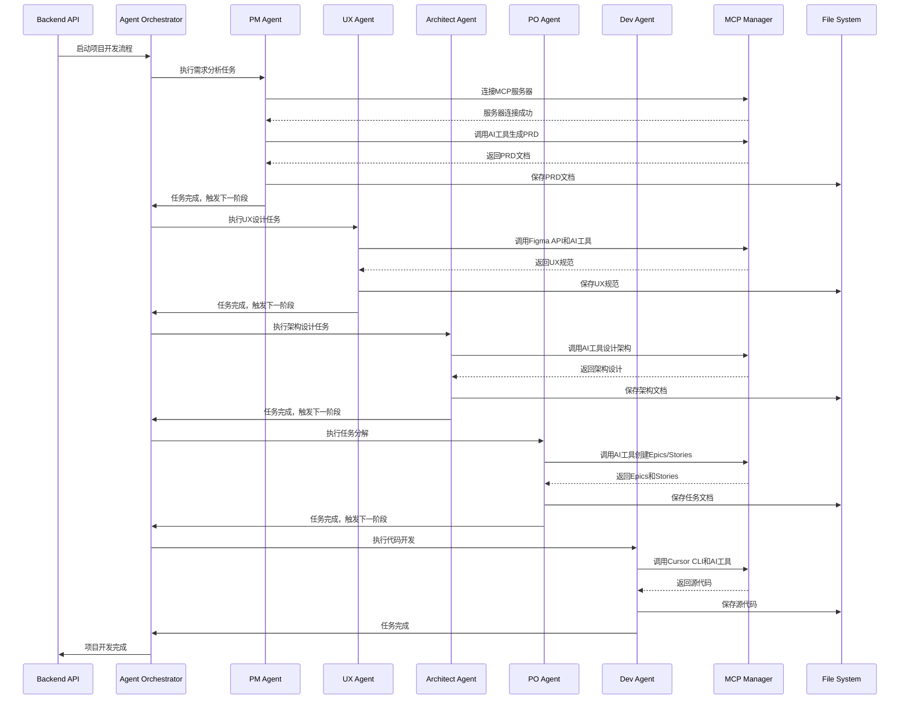

### 2. MCP服务器管理流程

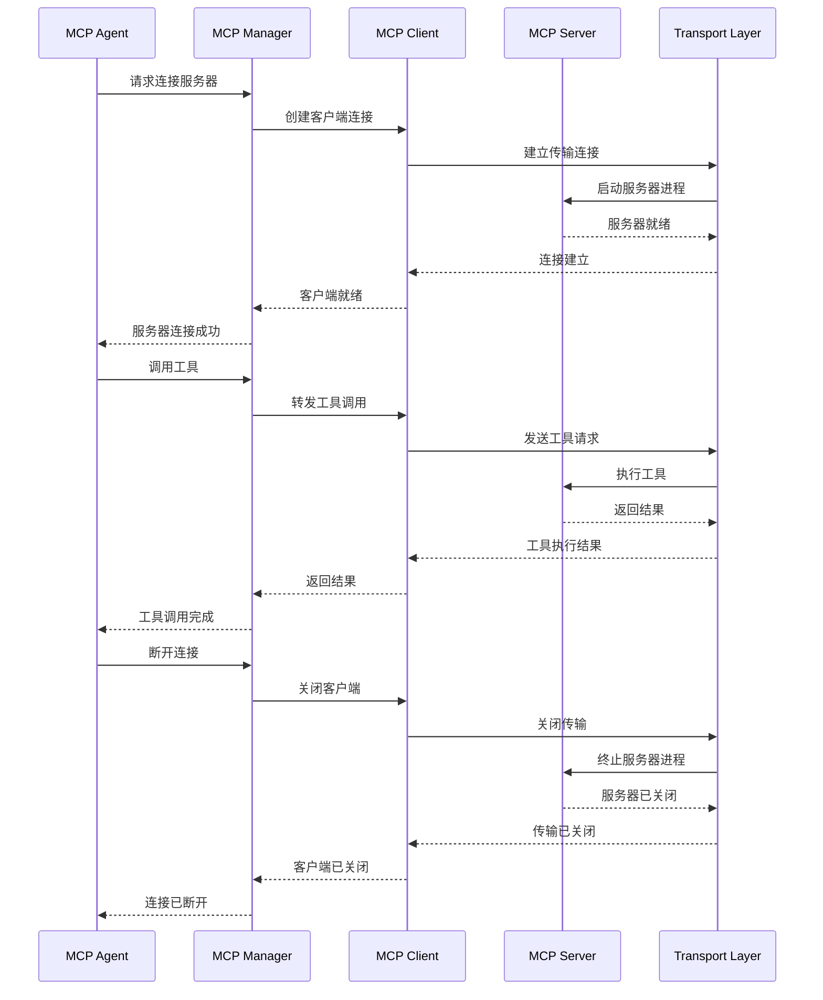

### 3. 错误处理和重试流程

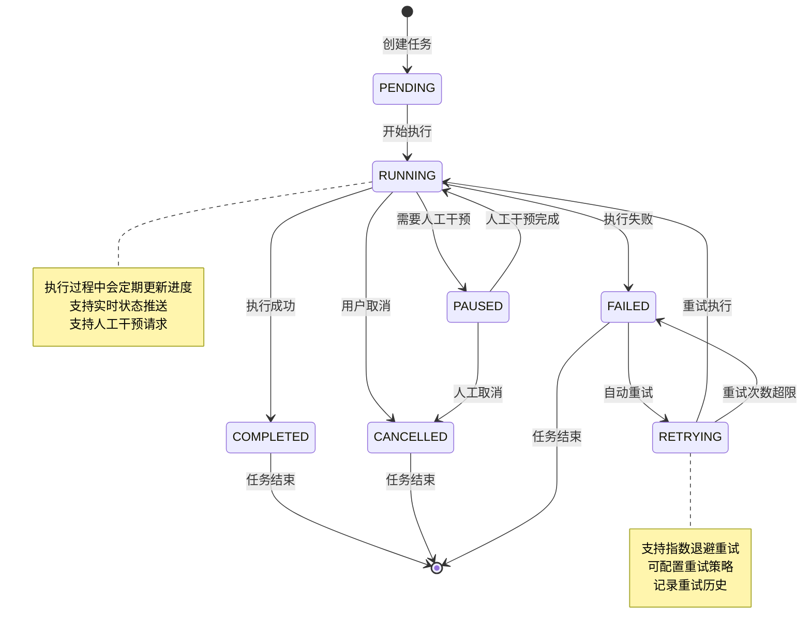

## 服务层设计

### 1. 文件系统服务

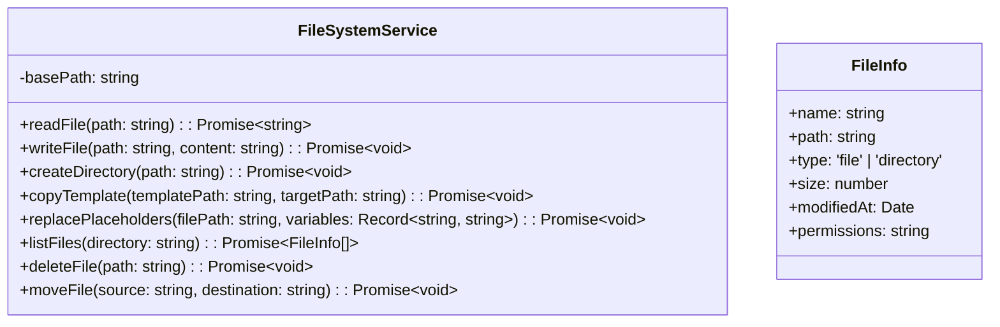

### 2. 命令执行服务

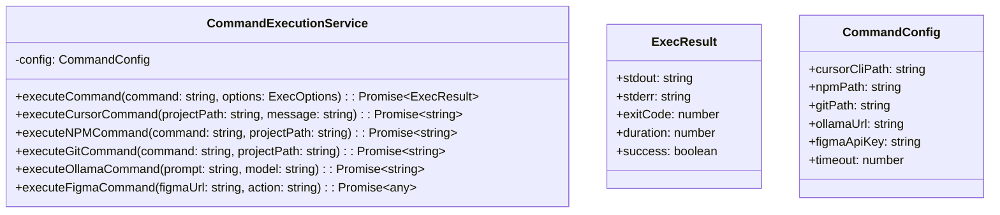

### 3. 通知服务

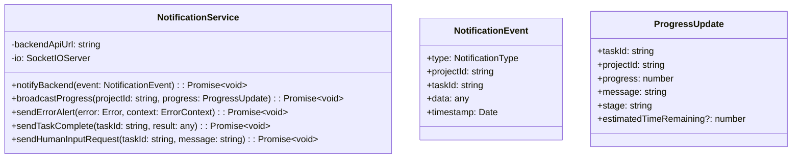

## 配置管理

### 1. 应用配置

```typescript
interface AppConfig {
  app: {
    port: number;
    nodeEnv: 'development' | 'production' | 'test';
    cors: CorsOptions;
    rateLimit: RateLimitOptions;
  };
  redis: {
    url: string;
    host: string;
    port: number;
    password?: string;
    db: number;
  };
  mcp: {
    servers: Record<string, ServerConfig>;
    timeout: number;
    retryAttempts: number;
  };
  projectDataPath: string;
  backendApiUrl: string;
  tools: CommandConfig;
  logging: {
    level: string;
    format: string;
    file?: string;
  };
}

interface ServerConfig {
  command: string;
  args: string[];
  description: string;
  timeout?: number;
  retryAttempts?: number;
  env?: Record<string, string>;
}
```

### 2. 环境变量配置

```bash
# 应用配置
NODE_ENV=development
PORT=3001
LOG_LEVEL=info

# Redis配置
REDIS_URL=redis://localhost:6379
REDIS_HOST=localhost
REDIS_PORT=6379
REDIS_PASSWORD=

# 后端API配置
BACKEND_API_URL=http://localhost:8080

# 项目数据路径
PROJECT_DATA_PATH=F:/app-maker/app_data/projects

# MCP服务器配置
MCP_TIMEOUT=30000
MCP_RETRY_ATTEMPTS=3

# 工具配置
CURSOR_CLI_PATH=C:\Program Files\Cursor\cursor.exe
NPM_PATH=C:\Program Files\nodejs\npm.cmd
GIT_PATH=C:\Program Files\Git\bin\git.exe
OLLAMA_URL=http://localhost:11434
FIGMA_API_KEY=your_figma_api_key
```

## 部署架构

### 1. 本地部署架构

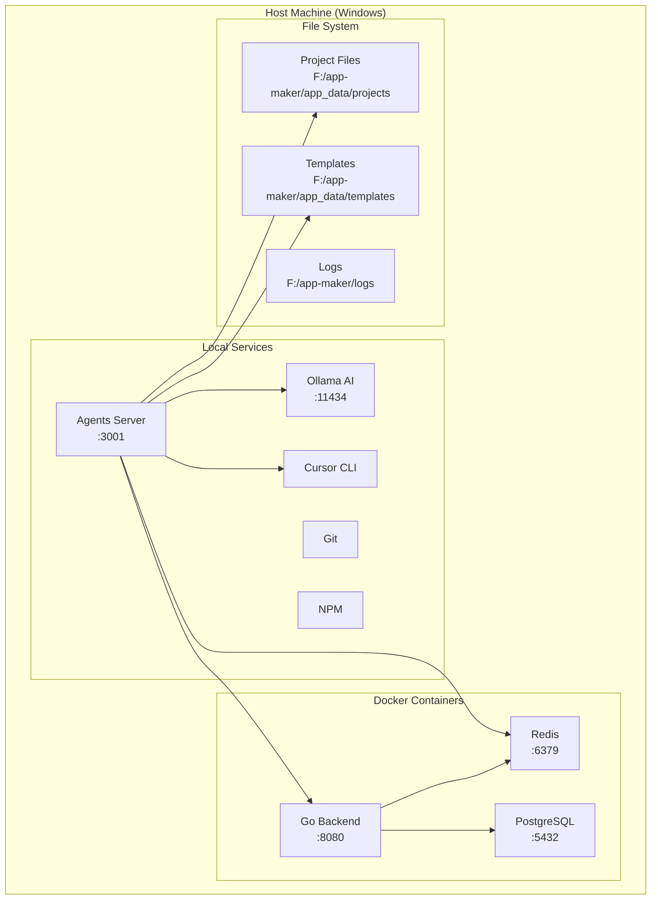

### 2. 进程管理

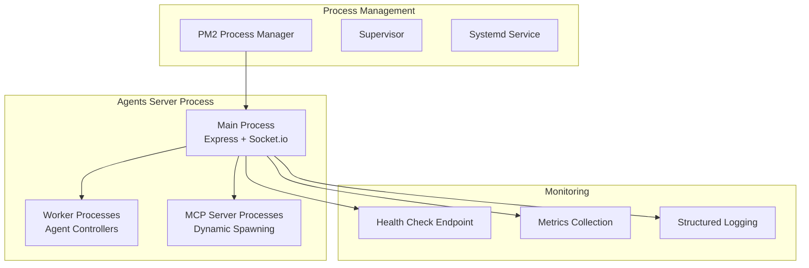

## 安全设计

### 1. 安全架构

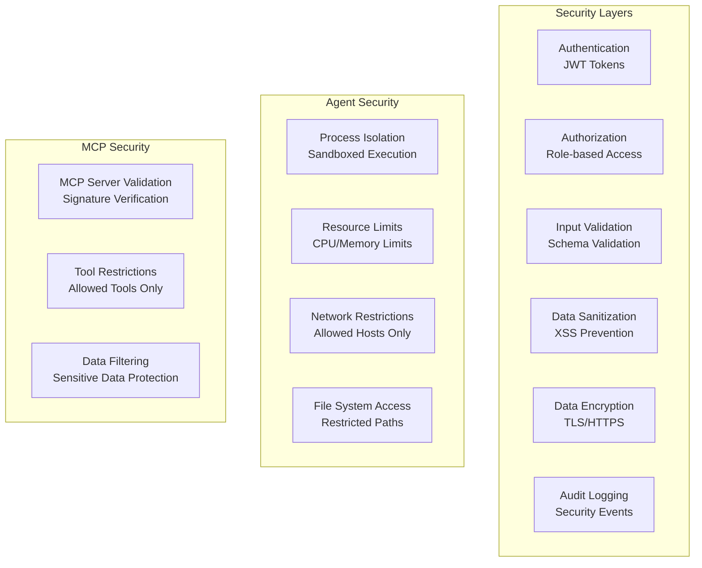

### 2. 权限控制

```typescript
interface SecurityConfig {
  authentication: {
    jwtSecret: string;
    tokenExpiry: string;
    refreshTokenExpiry: string;
  };
  authorization: {
    roles: string[];
    permissions: Record<string, string[]>;
  };
  mcp: {
    allowedServers: string[];
    allowedTools: Record<string, string[]>;
    serverValidation: boolean;
  };
  execution: {
    maxConcurrentTasks: number;
    maxExecutionTime: number;
    memoryLimit: string;
    cpuLimit: string;
  };
  fileSystem: {
    allowedPaths: string[];
    restrictedPaths: string[];
    maxFileSize: number;
  };
}
```

## 监控和日志

### 1. 监控架构

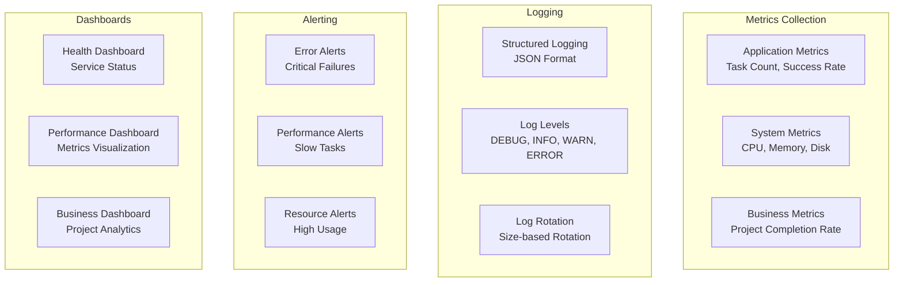

### 2. 日志格式

```typescript
interface LogEntry {
  timestamp: string;
  level: 'DEBUG' | 'INFO' | 'WARN' | 'ERROR';
  message: string;
  context: {
    projectId?: string;
    taskId?: string;
    agentType?: string;
    userId?: string;
    requestId?: string;
  };
  metadata?: Record<string, any>;
  error?: {
    name: string;
    message: string;
    stack: string;
  };
}
```

## 性能优化

### 1. 性能策略

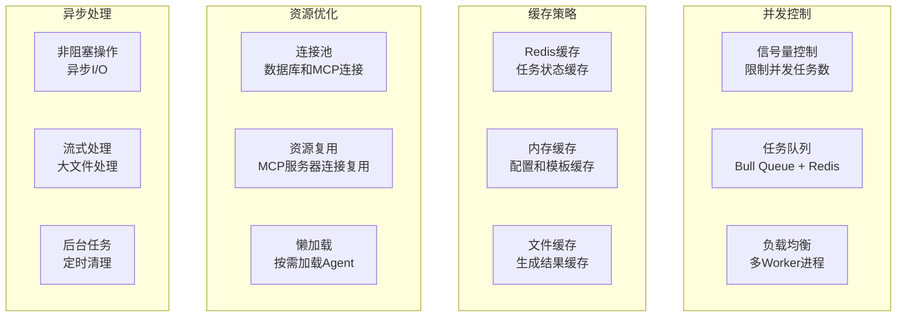

### 2. 性能指标

```typescript
interface PerformanceMetrics {
  taskExecution: {
    averageExecutionTime: number;
    successRate: number;
    failureRate: number;
    retryRate: number;
  };
  system: {
    cpuUsage: number;
    memoryUsage: number;
    diskUsage: number;
    networkLatency: number;
  };
  mcp: {
    serverConnectionTime: number;
    toolExecutionTime: number;
    serverAvailability: number;
  };
  business: {
    projectsCompletedPerHour: number;
    averageProjectCompletionTime: number;
    userSatisfactionScore: number;
  };
}
```

## 扩展性设计

### 1. 水平扩展

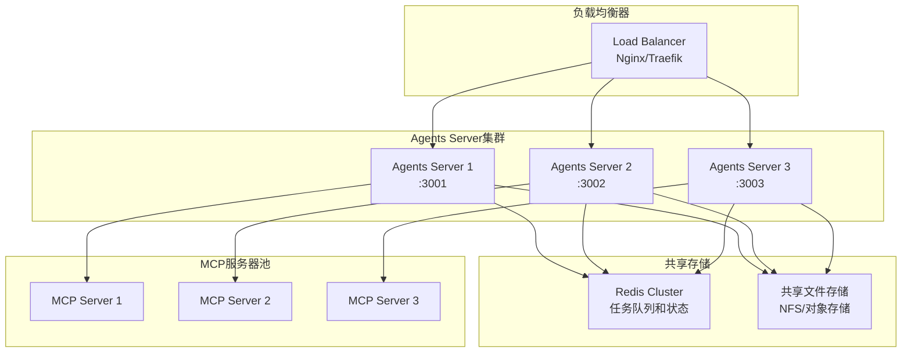

### 2. 插件架构

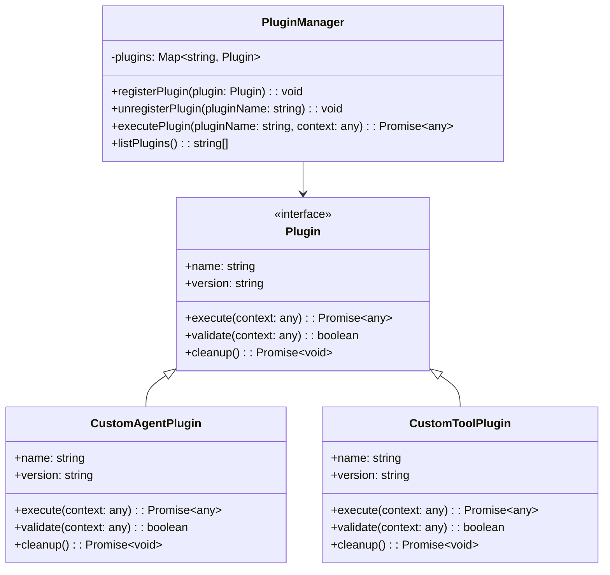

## 总结

Agents Server 架构设计遵循以下核心原则：

1. **模块化设计**: 每个组件职责清晰，便于维护和扩展
2. **异步处理**: 基于队列的任务处理，支持高并发和容错
3. **实时通信**: WebSocket支持实时状态更新和进度反馈
4. **MCP集成**: 标准化的MCP服务器连接和管理
5. **可扩展性**: 支持水平扩展和插件化扩展
6. **本地部署**: 直接运行在主机上，支持GPU加速和文件系统访问
7. **安全设计**: 多层安全防护，确保系统安全
8. **监控完善**: 全面的监控和日志系统，便于运维管理

该架构为后续的开发工程师提供了清晰的实现指导，确保系统能够稳定、高效地运行，并支持未来的功能扩展和性能优化。