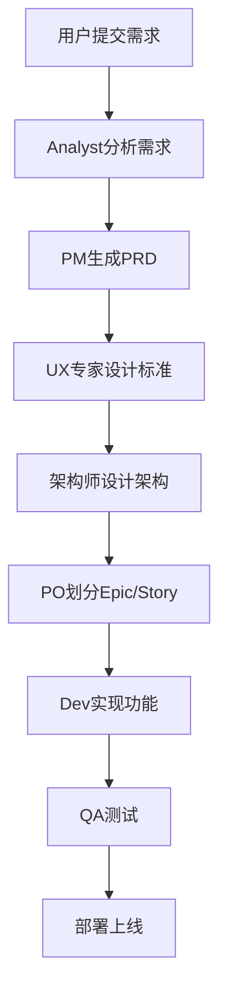

# App Maker Agents Service

App Maker Agents Service 是基于 Go + Gin + Asynq 的多Agent协作系统，为各种AI Agent提供统一的API接口和执行环境。该系统负责管理AI驱动的开发流程，包括需求分析、产品设计、架构设计、代码实现等多个环节。

## 🎯 系统概述

Agents Service 是 App Maker 项目的核心组件，它将复杂的软件开发过程分解为多个专业化任务，每个任务由相应的AI Agent负责完成。系统支持异步任务执行、实时状态反馈、Git集成等功能。

## 🏗️ 技术栈

- **Go 1.24**: 主要编程语言
- **Gin**: Web框架，提供RESTful API
- **Asynq**: 高性能异步任务队列
- **Redis**: 任务存储和缓存
- **Zap**: 结构化日志
- **Swagger**: API文档生成
- **Viper**: 配置管理
- **Git**: 版本控制集成

## 📁 项目结构

```
agents/
├── cmd/                       # 应用程序入口
│   └── server/
│       └── main.go            # 主服务入口
├── internal/
│   ├── api/
│   │   ├── handlers/         # HTTP处理器
│   │   │   ├── project_handler.go     # 项目管理处理器
│   │   │   ├── pm_handler.go          # 产品经理Agent
│   │   │   ├── dev_handler.go         # 开发工程师Agent
│   │   │   ├── analyse_handler.go     # 需求分析师Agent
│   │   │   ├── ux_handler.go          # UX专家Agent
│   │   │   ├── architect_handler.go  # 架构师Agent
│   │   │   ├── po_handler.go          # 产品负责人Agent
│   │   │   ├── task_handler.go        # 任务状态查询
│   │   │   └── health_handler.go      # 健康检查
│   │   └── routes/
│   │       └── routes.go              # 路由注册
│   ├── config/
│   │   └── config.go                 # 配置管理
│   ├── container/
│   │   └── container.go              # 依赖注入容器
│   └── services/
│       ├── agent_task_service.go     # Agent任务服务
│       ├── project_service.go        # 项目管理服务
│       ├── command_service.go        # 命令行执行服务
│       └── git_service.go           # Git操作服务
├── docs/
│   ├── docs.go               # Swagger文档配置
│   └── swagger.yaml          # Swagger配置
├── go.mod                    # Go模块依赖
├── go.sum                    # 依赖校验和
└── README.md                 # 项目说明
```

## 🤖 支持的Agent类型

| Agent | 中文名 | 英文名 | 职责 |
|-------|--------|--------|------|
| Analyst | 需求分析师 | Mary | 分析项目需求，生成项目简介和市场研究 |
| PM | 产品经理 | John | 编写产品需求文档(PRD) |
| UX Expert | UX专家 | Sally | 设计用户体验标准和界面规范 |
| Architect | 架构师 | Winston | 设计系统架构、数据库、API接口 |
| PO | 产品负责人 | Sarah | 划分Epic和用户故事 |
| Dev | 开发工程师 | James | 实现用户故事、修复Bug、测试、部署 |
| QA | 测试工程师 | Quinn | 质量保证和测试 |
| SM | 敏捷教练 | Bob | 项目管理咨询 |

## 🔄 工作流程



## 🚀 快速开始

### 环境要求

- Go 1.24+
- Redis 7+
- Git
- Node.js (用于前端依赖安装)

### 安装和运行

```bash
# 1. 克隆项目
git clone <repository-url>
cd agents

# 2. 安装依赖
go mod tidy

# 3. 配置环境
cp config.yaml.example config.yaml
# 编辑配置文件，设置Redis连接等信息

# 4. 启动Redis服务
redis-server

# 5. 启动Agent服务
go run cmd/server/main.go
```

### Docker运行

```bash
# 使用Docker Compose启动全套服务
docker-compose up -d

# 或者单独构建和运行
docker build -t app-maker-agents .
docker run -p 8088:8088 app-maker-agents
```

## 📡 API接口

服务启动后可访问 `http://localhost:8088/swagger/index.html` 查看完整的API文档。

### 核心API端点

#### 项目环境准备
```
POST /api/v1/project/setup
```

#### Agent任务接口
```
POST /api/v1/agent/analyse/project-brief    # 需求分析
POST /api/v1/agent/pm/prd                  # PRD生成
POST /api/v1/agent/ux-expert/ux-standard    # UX标准
POST /api/v1/agent/architect/architect      # 架构设计
POST /api/v1/agent/architect/database       # 数据库设计
POST /api/v1/agent/architect/apidefinition  # API定义
POST /api/v1/agent/po/epicsandstories       # Epic和Story
POST /api/v1/agent/dev/implstory            # 实现Story
POST /api/v1/agent/dev/fixbug               # 修复Bug
POST /api/v1/agent/dev/runtest              # 运行测试
POST /api/v1/agent/dev/deploy               # 部署项目
```

#### 任务状态查询
```
GET /api/v1/tasks/{task_id}     # 获取任务状态
GET /api/v1/health              # 健康检查
```

## 🔧 配置说明

### 环境变量

| 变量名 | 默认值 | 说明 |
|-------|--------|------|
| `AGENTS_PORT` | 8088 | 服务监听端口 |
| `AGENTS_ENVIRONMENT` | development | 运行环境 |
| `AGENTS_WORKSPACE_PATH` | F:/app-maker/app_data | 工作空间路径 |
| `AGENTS_LOG_LEVEL` | debug | 日志级别 |
| `REDIS_HOST` | localhost | Redis主机 |
| `REDIS_PORT` | 6379 | Redis端口 |
| `REDIS_PASSWORD` | "" | Redis密码 |
| `REDIS_DB` | 1 | Redis数据库编号 |

### 配置文件

可以通过 `config.yaml` 文件进行配置：

```yaml
app:
  port: "8088"
  environment: "development"
  workspace_path: "F:/app-maker/app_data"

log:
  level: "debug"
  file: "./logs/app-maker-agents.log"

command:
  timeout: "5m"
  cli_tool: "claude"

redis:
  host: "localhost"
  port: 6379
  password: ""
  db: 1

asynq:
  concurrency: 100
```

## 🔌 集成说明

### 与Backend服务集成

Backend服务通过 shared-models 客户端调用Agent服务：

```go
// 创建客户端
agentClient := client.NewAgentClient("http://localhost:8088", 5*time.Minute)

// 生成PRD
result, err := agentClient.GetPRD(ctx, &agent.GetPRDReq{
    ProjectGuid: "project-guid",
    Requirements: "创建一个电商平台",
})
```

### Git集成

Agent执行完成后会自动提交代码到Git仓库：

1. 执行Agent任务
2. 将生成的文档和代码提交到Git
3. 推送到远程仓库
4. 触发GitLab CI/CD流水线进行自动部署

## 🔍 任务执行机制

### 异步任务处理

系统使用Asynq实现异步任务处理：

- **任务队列**: 支持critical、default、low三个优先级队列
- **并发控制**: 可配置并发worker数量
- **任务重试**: 支持任务失败重试机制
- **状态追踪**: 实时任务状态和进度更新

### 任务类型

- `agent:execute`: Agent执行任务
- `agent:setup`: 项目环境准备任务

## 🛠️ 开发指南

### 添加新的Agent

1. 在 `handlers/` 目录下创建新的处理器
2. 在 `agent/` 模块中添加相应的请求响应结构
3. 在 `routes/routes.go` 中注册路由
4. 在 `container/container.go` 中注入依赖

### 扩展Agent功能

每个Agent处理器都可以集成不同的AI工具：
- claude-code (Anthropic)
- cursor
- qwen-code
- codex
- auggie-cli
- iflow-cli
- windsurf
- trae
- gemini
- cline
- github-copilot
- opencode
- roo
- kilo

## 📊 监控和日志

### 日志管理

- 使用Zap进行结构化日志记录
- 支持不同级别的日志输出
- 日志文件自动轮转
- 包含请求追踪和性能指标

### 任务监控

- 实时任务状态查看
- 任务执行历史记录
- 性能指标统计
- 错误详情追踪

## 🔒 安全性

- API访问控制
- 敏感信息保护
- 输入验证和过滤

## 📄 贡献指南

1. Fork 项目
2. 创建功能分支 (`git checkout -b feature/AmazingFeature`)
3. 提交更改 (`git commit -m 'Add some AmazingFeature'`)
4. 推送到分支 (`git push origin feature/AmazingFeature`)
5. 打开 Pull Request

## 📄 许可证

本项目采用 AGPLv3 许可证 - 查看 [LICENSE](..\LICENSE) 文件了解详情。如果您希望在不遵守AGPL条款的项目中集成本代码，需要另行购买商业许可，请联系我。

---
## 联系方式

- 维护者: AI探趣星船长（抖音、小红书、B站同名）
- 邮箱: qqjack2012@gmail.com
- 项目地址: https://github.com/lighthought/app-maker
