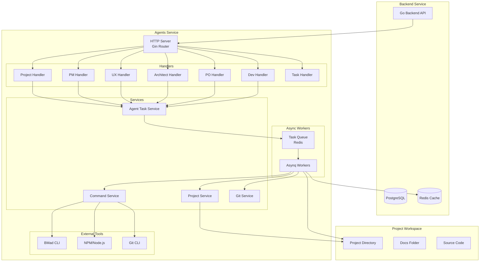
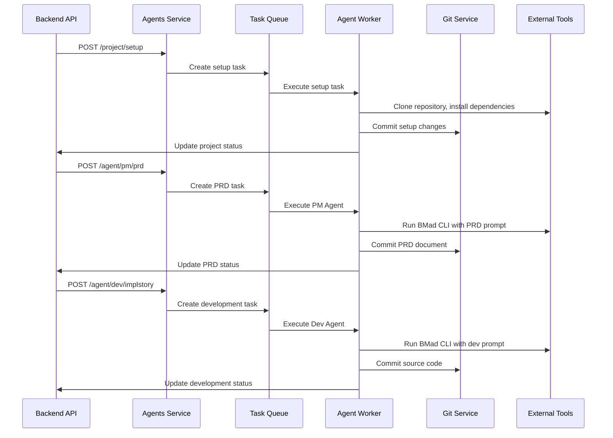
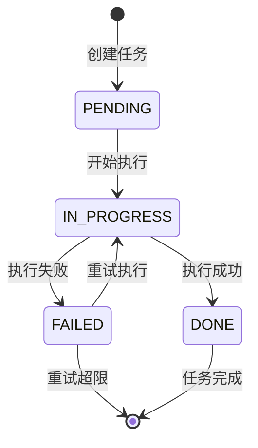
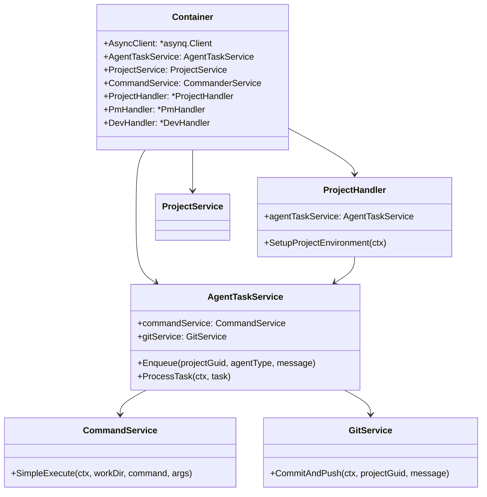

# App Maker Agents Service 架构设计

## 概述

App Maker Agents Service 是基于 Go + Gin + Asynq 架构的多Agent协作开发服务，为自动化软件开发平台提供统一的Agent执行环境。服务通过HTTP API与backend系统集成，支持异步任务执行、实时状态反馈和Git工作流管理。

## 技术架构

### 核心框架
- **Go 1.24**: 高性能的系统编程语言
- **Gin**: 轻量级、高性能的Web框架
- **Asynq**: Redis基础上的异步任务队列系统
- **Zap**: 高性能结构化日志库
- **Swagger**: 自动API文档生成

### 基础设施
- **Redis**: 任务存储、缓存和队列管理
- **Git**: 版本控制和代码提交管理
- **共享模块**: shared-models提供统一的API接口

## 系统架构

### 整体架构图



## Agent协作流程

### 开发阶段流程图



### 任务状态流转



## API接口设计

### REST API端点

#### 项目管理
```http
POST /api/v1/project/setup
```

#### Agent任务接口
```http
POST /api/v1/agent/pm/prd                  # PRD生成
POST /api/v1/agent/ux-expert/ux-standard  # UX标准设计
POST /api/v1/agent/architect/architect     # 架构设计
POST /api/v1/agent/po/epicsandstories      # Epic和Story
POST /api/v1/agent/dev/implstory           # 实现Story
POST /api/v1/agent/dev/fixbug              # 修复Bug
```

### 任务状态查询
```http
GET /api/v1/tasks/{task_id}
```

## 系统组件关系图



## 总结

App Maker Agents Service 采用现代化的微服务架构，具有以下特点：

1. **高性能**: 基于Go语言构建，支持高并发处理
2. **异步处理**: 使用Asynq实现任务队列，支持可靠的任务执行
3. **模块化设计**: 清晰的层次结构，便于维护和扩展
4. **集成简单**: 通过shared-models与Backend无缝集成
5. **工具链支持**: 灵活集成BMad CLI、Git等外部工具
6. **错误处理**: 完善的错误处理和重试机制
7. **实时反馈**: 支持任务状态实时查询和进度更新

---
## 联系方式

- 维护者: AI探趣星船长（抖音、小红书、B站同名）
- 邮箱: qqjack2012@gmail.com
- 项目地址: https://github.com/lighthought/app-maker
