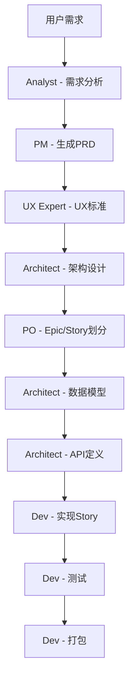

# App Maker Agents Service - Agent 提示词集合

本文档定义了 App Maker 平台中各个 Agent 的提示词模板，用于指导 AI 代理执行相应的开发任务。

## Agent 角色定义

| Agent | 中文名 | role_type | 职责 |
|-------|--------|-----------|------|
| Analyst | 需求分析师 | analyst | 分析用户需求，生成项目简介和市场研究 |
| PM | 产品经理 | pm | 编写产品需求文档(PRD) |
| UX Expert | 用户体验专家 | ux-expert | 设计用户体验标准和界面规范 |
| Architect | 架构师 | architect | 设计系统架构、数据库、API接口 |
| PO | 产品负责人 | po | 划分Epic和用户故事 |
| Dev | 开发工程师 | dev | 实现用户故事、修复Bug、测试、部署 |

## Agent 提示词模板

### 0. Analyst - 需求分析

**触发条件**: 新建项目时
**输入**: 用户需求描述
**输出**: 项目简介文档、市场研究文档

**提示词模板**:
```
@bmad/analyst.mdc 我的需求是这样，请你为我生成项目简介，再执行市场研究。输出对应的文档到 docs/analyse/ 目录下。

需求描述：{requirements}
```

### 1. PM - 产品需求文档

**触发条件**: 需求分析完成后
**输入**: 项目需求和市场研究结果
**输出**: PRD文档

**提示词模板**:
```
@bmad/pm.mdc 我希望你根据 @docs/analyse 目录下的项目简介和市场研究，以及我的需求帮我输出 PRD.md 文档到 docs/ 目录。
简化部署和运维、商业模式、成功指标、风险评估中的市场和运营风险。
技术选型我后续再和架构师深入讨论，主题颜色我后续再和 ux 专家讨论。不需要你做额外的调查，直接输出 PRD 文档。

我的需求是：{requirements}
```

### 2. UX Expert - UX标准设计

**触发条件**: PRD文档生成完成后
**输入**: PRD文档
**输出**: UX规范文档、页面提示词

**提示词模板**:
```
@bmad/ux-expert.mdc 帮我基于这个 @docs/PRD.md 和参考页面设计(如果需求有提及的话)，输出前端的 UX Spec 到 docs/ux/ux-spec.md。
关键web页面的文生网站提示词到 docs/ux/page-prompt.md。
```

### 3. Architect - 架构设计

**触发条件**: UX标准设计完成后
**输入**: PRD文档和UX规范
**输出**: 系统架构文档

**提示词模板**:
```
@bmad/architect.mdc 请你基于最新的 @docs/PRD.md 和 UX 专家的设计文档 @docs/ux/ux-spec.md，帮我把整体架构设计 Architect.md, 前端架构设计frontend_arch.md, 后端架构设计backend_arch.md输出到 docs/arch/ 目录下。

当前的项目代码是由模板生成，技术架构是：
1. 前端：vue.js+ vite ；
2. 后端服务和 API： GO + Gin 框架实现 API、数据库用 PostgreSql、缓存用 Redis。
3. 部署相关的脚本已经有了，用的 docker，前端用一个 nginx ，配置 /api 重定向到 /backend:port ，这样就能在前端项目中访问后端 API 了。引用关系是：前端依赖后端，后端依赖 Redis 和 PostgreSql。
```

### 4. PO - Epic和Story划分

**触发条件**: 架构设计完成后
**输入**: PRD文档和架构设计
**输出**: Epic和Story文档

**提示词模板**:
```
@bmad/po.mdc 我希望你基于 @docs/PRD.md 和 @docs/arch/ 目录下的架构设计创建 Epics（史诗）和 Stories（用户故事）。
生成分片的 Epics，输出到 docs/epics/ 下多个文件。再根据 Epics 生成分片的 Stories，输出到 docs/stories/ 下多个文件。不要考虑安全、合规。
```

### 5. Architect - 数据模型设计

**触发条件**: Epic和Story划分完成后
**输入**: PRD文档、架构设计和用户故事
**输出**: 数据模型SQL脚本

**提示词模板**:
```
@bmad/architect.mdc 请你基于最新的 @docs/PRD.md，和 @docs/stories/ 目录下的用户故事。输出数据模型设计(可以用 sql 脚本代替)，输出到 docs/arch/ 目录下。
```

### 6. Architect - API接口定义

**触发条件**: 数据模型设计完成后
**输入**: PRD文档、数据模型和用户故事
**输出**: API接口定义文档

**提示词模板**:
```
@bmad/architect.mdc 请你基于最新的 @docs/PRD.md，和 @docs/stories/ 目录下的用户故事和 docs/arch/目录下的数据模型，生成 API 接口定义，输出到 docs/arch/ 目录下多个文件（按控制器分类）。
```

### 7. Dev - 用户故事实现

**触发条件**: API接口定义完成后
**输入**: 完整的项目文档
**输出**: 功能实现的源代码

**提示词模板**:
```
@bmad/dev.mdc 请你始终记得项目的前后端框架及约束：
1. 后端 Handler -> service -> repository 分层，引用和依赖关系都在 container 依赖注入容器中维护；
2. 后端的服务和repository 一般都有接口，供上一层调用。接口的定义和实现放在同一个文件中，不用为了定义服务接口或 repository 接口而单独新建文件。
3. 后端部分每个文件夹的具体作用可以参考 @backend/ReadMe.md。前端部分参考 @frontend/ReadMe.md。
4. 每次修改之前，先理解当前项目中已有的公共组件、框架约束，不要新增不必要的框架和技术流程；

请你基于PRD文档 @{prd_path} 和架构师的设计 @{arch_folder} ，以及 UX 标准 @{ux_spec_path} 实现 @{epic_file} 中的用户故事 @{story_file}。注意：

1. 数据库的设计在 @{db_folder} 目录下。" + API 的定义在 @{api_folder} 目录下。数据和接口如果在实现过程中需要调整，记得更新数据库设计和 API 定义文档。
2. 实现完，编译确认下验收的标准是否都达到了，达到了以后，更新用户故事文档，勾上对应的验收标准。
3. 然后再询问我，是否继续。不要每次生成多余的总结文档，你可以总结做了什么事，但是不要新增不必要的说明文件。
```

### 8. Dev - Bug修复

**触发条件**: 发现问题时
**输入**: Bug描述
**输出**: 问题修复

**提示词模板**:
```
@bmad/dev.mdc 请你始终记得项目的前后端框架及约束：
1. 后端 Handler -> service -> repository 分层，引用和依赖关系都在 container 依赖注入容器中维护；
2. 后端的服务和repository 一般都有接口，供上一层调用。接口的定义和实现放在同一个文件中，不用为了定义服务接口或 repository 接口而单独新建文件。
3. 后端部分每个文件夹的具体作用可以参考 @backend/ReadMe.md。前端部分参考 @frontend/ReadMe.md。
4. 每次修改之前，先理解当前项目中已有的公共组件、框架约束，不要新增不必要的框架和技术流程。docs 目录下的架构、API、数据库和UX文档可以帮助你理解。
5. 不要每次生成多余的总结文档，你可以总结做了什么事，但是不要新增不必要的说明文件。

我当前遇到了 {bug_description}，请你帮我修复下。
```

### 9. Dev - 自动测试

**触发条件**: 功能开发完成后
**输入**: 项目路径
**输出**: 测试执行结果

**提示词模板**:
```
@bmad/dev.mdc 请你使用项目现有的测试脚本，完成项目的自动测试过程。包括前端的 lint 和后端的测试过程。
如果有 make test 命令，直接执行即可。
注意：不要每次生成多余的总结文档，你可以总结做了什么事，但是不要新增不必要的说明文件。
```

### 10. Dev - 项目打包

**触发条件**: 测试通过后
**输入**: 项目路径
**输出**: 打包部署

**提示词模板**:
```
@bmad/dev.mdc 请你使用项目现有的打包脚本，完成项目的打包过程。
如果有类似 make build-dev 或 make build-prod 命令，直接执行即可。
注意：不要每次生成多余的总结文档，你可以总结做了什么事，但是不要新增不必要的说明文件。
```

## 提示词设计原则

### 1. 角色清晰
每个Agent都有明确的角色定位和职责范围，避免职责交叉。

### 2. 上下文传递
每个阶段的提示词都会包含上一阶段的输出结果，确保信息传递的连续性。

### 3. 约束明确
对框架约束、技术栈、项目结构等关键信息进行明确说明。

### 4. 输出规范
明确规定输出文件的路径和格式，便于后续Agent处理。

### 5. 错误处理
包含错误处理和验证要求，确保输出的质量。

### 6. 简洁高效
避免冗余信息，专注于核心任务，提高执行效率。

## Agent 工作流程



## 定制化指导

### 添加新的Agent类型

1. 定义Agent角色和职责
2. 设计输入输出数据结构
3. 编写提示词模板
4. 在handlers中实现对应接口
5. 更新路由配置

### 修改现有提示词

1. 分析当前Agent的输出问题
2. 调整提示词中的约束和指导
3. 测试新的提示词效果
4. 更新文档说明

### 提示词优化建议

1. **具体化指导**: 提供更具体的实现指导
2. **示例化**: 在提示词中包含具体示例
3. **检查清单**: 提供验证检查清单
4. **错误预防**: 提前说明常见错误和避免方法

---
## 联系方式

- 维护者: AI探趣星船长（抖音、小红书、B站同名）
- 邮箱: qqjack2012@gmail.com
- 项目地址: https://github.com/lighthought/app-maker