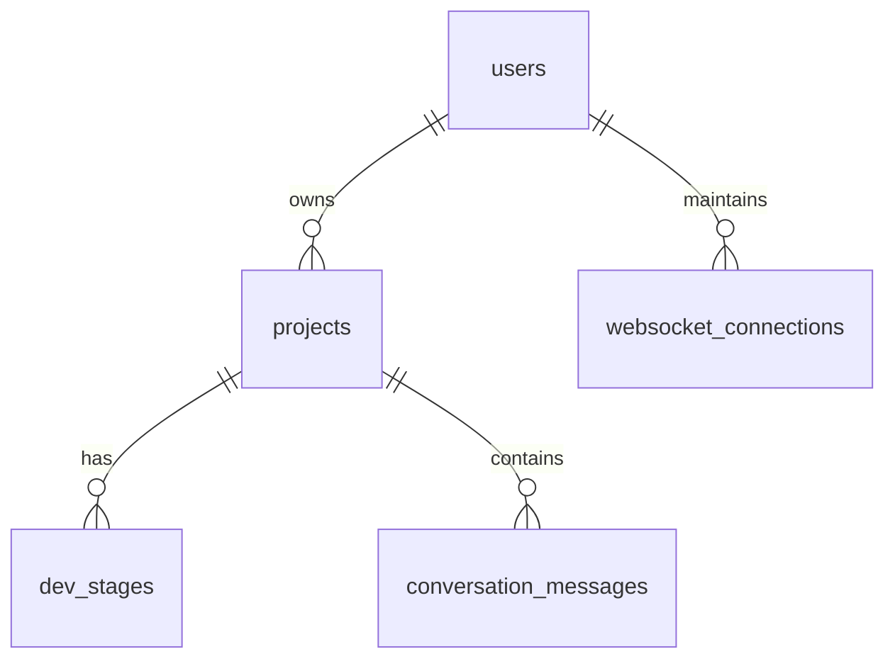

# App Maker Backend Service

App Maker Backend Service 是基于 Go + Gin + GORM + PostgreSQL + Redis 构建的多Agent协作自动化开发平台的核心服务。提供项目管理、异步任务执行、WebSocket实时通信等核心功能。

## 🎯 系统概述

Backend Service 是 App Maker 项目的主要服务，负责协调前端和Agents服务，管理项目生命周期，提供用户认证、项目管理、实时通信等功能。系统采用微服务架构，支持分布式部署和高并发处理。

## 🏗️ 技术栈

- **语言**: Go 1.24+
- **Web框架**: Gin 1.9+
- **ORM**: GORM 1.25+
- **数据库**: PostgreSQL 15+
- **缓存**: Redis 7+
- **配置管理**: Viper
- **日志**: Zap (通过shared-models)
- **认证**: JWT (通过shared-models)
- **异步任务**: Asynq
- **实时通信**: WebSocket

## 📁 项目结构

```
backend/
├── cmd/                       # 应用程序入口
│   └── server/
│       └── main.go           # 主服务入口
├── internal/
│   ├── api/
│   │   ├── handlers/         # HTTP处理器
│   │   │   ├── cache_handler.go       # 缓存管理
│   │   │   ├── chat_handler.go        # 对话管理
│   │   │   ├── file_handler.go        # 文件操作
│   │   │   ├── project_handler.go     # 项目管理
│   │   │   ├── task_handler.go        # 任务状态查询
│   │   │   └── user_handler.go        # 用户管理
│   │   ├── middleware/       # 中间件
│   │   │   ├── auth.go                # 认证中间件
│   │   │   ├── cors.go                # CORS中间件
│   │   │   └── logger.go              # 日志中间件
│   │   └── routes/
│   │       └── routes.go              # 路由注册
│   ├── config/
│   │   └── config.go                 # 配置管理
│   ├── container/
│   │   └── container.go              # 依赖注入容器
│   ├── database/
│   │   ├── connection.go             # 数据库连接
│   │   └── seeds.go                  # 数据库种子数据
│   ├── models/               # 数据模型
│   │   ├── conversation.go           # 对话模型
│   │   ├── file.go                  # 文件模型
│   │   ├── project.go               # 项目模型
│   │ ├── request.go                 # 请求模型
│   │   ├── response.go              # 响应模型
│   │   ├── stage.go                 # 项目阶段模型
│   │   ├── user.go                  # 用户模型
│   │   └── websocket.go             # WebSocket模型
│   ├── repositories/         # 数据访问层
│   │   ├── message_repository.go     # 消息存储
│   │   ├── project_repository.go     # 项目存储
│   │   ├── stage_repository.go      # 阶段存储
│   │   └── user_repository.go       # 用户存储
│   ├── services/             # 业务逻辑层
│   │   ├── file_service.go           # 文件服务
│   │   ├── git_service.go           # Git操作服务
│   │   ├── message_service.go       # 消息服务
│   │   ├── project_service.go       # 项目管理服务
│   │   ├── project_stage_service.go # 项目开发阶段服务
│   │   ├── project_template_service.go # 项目模板服务
│   │   └── user_service.go          # 用户管理服务
│   └── worker/
│       └── project.go               # 后台工作任务
├── pkg/                       # 可导出的包
│   └── cache/                 # 缓存管理
│       ├── factory.go         # 缓存工厂
│       ├── interface.go       # 缓存接口定义
│       ├── keys.go            # 缓存键管理
│       ├── monitor.go         # 缓存监控
│       └── redis.go          # Redis缓存实现
├── configs/                   # 配置文件
│   ├── config.yaml           # 开发环境配置
│   └── config.prod.yaml     # 生产环境配置
├── data/                     # 数据文件
│   └── template.zip          # 项目模板压缩包
├── docs/                     # API文档
│   ├── docs.go              # Swagger文档配置
│   └── swagger.yaml         # Swagger配置
├── scripts/                 # 脚本文件
│   ├── backup-db.sh         # 数据库备份脚本
│   ├── deploy.sh            # 部署脚本
│   └── init-db.sql          # 数据库初始化SQL
├── go.mod                   # Go模块依赖
├── go.sum                   # 依赖校验
├── Dockerfile               # Docker构建文件
├── Dockerfile.prod          # 生产环境Docker文件
└── ReadMe.md               # 项目说明
```

## 🚀 核心功能

### 1. 项目管理

- **项目创建**: 支持需求输入、项目初始化
- **项目状态跟踪**: 实时监控项目开发进度
- **项目生命周期管理**: 从创建到部署的完整流程
- **端口管理**: 自动分配开发环境端口

### 2. 用户认证与授权

- **用户注册/登录**: JWT token 认证
- **权限管理**: 基于角色的访问控制
- **会话管理**: 刷新令牌机制
- **安全保护**: 密码加密、输入验证

### 3. 异步任务执行

- **多阶段开发流程**: 需求分析→PRD→架构→开发→测试→部署
- **并发控制**: 最多3个并发任务执行
- **任务队列**: 基于 Asynq + Redis 的任务调度
- **实时状态更新**: WebSocket推送任务进度

### 4. WebSocket实时通信

- **项目房间管理**: 用户在项目房间中实时协作
- **Agent状态推送**: 开发阶段和进度的实时更新
- **对话管理**: 用户与AI Agent的交互历史
- **调试信息**: WebSocket连接状态监控

### 5. 文件管理

- **项目文件浏览**: 树形结构查看项目文件
- **文件内容查看**: 支持多种文件类型
- **文件下载**: 项目打包下载功能

## 🔧 开发阶段管理

系统定义了完整的项目开发流程，每个阶段都有明确的职责和状态管理：

```go
const (
    DevStatusInitializing       = "initializing"        // 等待开始
    DevStatusSetupEnvironment   = "setup_environment"   // 环境准备
    DevStatusPendingAgents      = "pending_agents"      // 等待Agents处理
    DevStatusCheckRequirement   = "check_requirement"   // 需求检查
    DevStatusGeneratePRD        = "generate_prd"        // 生成PRD
    DevStatusDefineUXStandard   = "define_ux_standard"  // UX标准定义
    DevStatusDesignArchitecture = "design_architecture"  // 架构设计
    DevStatusPlanEpicAndStory   = "plan_epic_and_story" // Epic和Story划分
    DevStatusDefineDataModel    = "define_data_model"   // 数据模型定义
    DevStatusDefineAPI          = "define_api"          // API接口定义
    DevStatusDevelopStory       = "develop_story"       // Story开发
    DevStatusFixBug             = "fix_bug"             // 问题修复
    DevStatusRunTest            = "run_test"            // 自动测试
    DevStatusDeploy             = "deploy"              // 部署
    DevStatusDone               = "done"                 // 完成
)
```

## 🔌 Agents服务集成

Backend通过shared-models客户端与Agents服务进行通信：

```go
// 创建Agent客户端
agentClient := client.NewAgentClient("http://localhost:8088", 10*time.Second)

// 调用不同Agent
result, _ := agentClient.GetPRD(ctx, &agent.GetPRDReq{
    ProjectGuid: projectGuid,
    Requirements: requirements,
})
```

## 📊 数据库设计

### 核心数据表

| 表名 | 说明 |
|------|------|
| users | 用户信息 |
| projects | 项目信息 |
| dev_stages | 项目开发阶段 |
| conversation_messages | 对话消息 |
| websocket_connections | WebSocket连接 |

### 关系设计



## 🔐 安全特性

- **JWT认证**: Token-based认证机制
- **密码加密**: bcrypt加密存储
- **输入验证**: 请求参数验证和过滤
- **CORS配置**: 跨域资源共享控制
- **认证中间件**: 路由级别的权限控制

## 📱 API接口

服务启动后可访问 `http://localhost:8080/swagger/index.html` 查看完整的API文档。

### 主要API端点

#### 用户认证
```http
POST /api/v1/auth/register     # 用户注册
POST /api/v1/auth/login       # 用户登录
POST /api/v1/auth/refresh     # 刷新令牌
```

#### 项目管理
```http
POST   /api/v1/projects/              # 创建项目
GET    /api/v1/projects/              # 获取项目列表
GET    /api/v1/projects/{guid}         # 获取项目详情
DELETE /api/v1/projects/{guid}         # 删除项目
GET    /api/v1/projects/{guid}/stages  # 获取开发阶段
```

#### 文件操作
```http
GET /api/v1/files/files/{guid}        # 获取项目文件列表
GET /api/v1/files/filecontent/{guid}   # 获取文件内容
```

#### 对话管理
```http
GET  /api/v1/chat/messages/{guid}     # 获取对话历史
POST /api/v1/chat/chat/{guid}         # 发送消息
```

#### WebSocket
```http
GET /ws/project/{guid}                # WebSocket连接
```

## ⚙️ 配置说明

### 环境变量

| 变量名 | 默认值 | 说明 |
|-------|--------|------|
| `DB_HOST` | localhost | 数据库主机 |
| `DB_PORT` | 5432 | 数据库端口 |
| `DB_NAME` | app_maker | 数据库名称 |
| `DB_USER` | postgres | 数据库用户 |
| `DB_PASSWORD` | - | 数据库密码 |
| `REDIS_HOST` | localhost | Redis主机 |
| `REDIS_PORT` | 6379 | Redis端口 |
| `JWT_SECRET` | - | JWT密钥 |
| `AGENTS_SERVER_URL` | http://localhost:8088 | Agents服务地址 |
| `GIN_MODE` | debug | Gin运行模式 |

### 配置文件

通过 `configs/config.yaml` 进行配置：

```yaml
app:
  port: "8080"
  environment: "development"

database:
  host: "localhost"
  port: 5432
  name: "app_maker"
  user: "postgres"
  password: "password"

redis:
  host: "localhost"
  port: 6379
  password: ""

agents:
  url: "http://localhost:8088"

jwt:
  secret_key: "your-secret-key"
  expire_hours: 24
```

## 🚀 快速开始

### 环境要求

- Go 1.24+
- PostgreSQL 15+
- Redis 7+
- Docker & Docker Compose (可选)

### 本地开发

```bash
# 1. 克隆项目
git clone <repository-url>
cd backend

# 2. 安装依赖
go mod tidy

# 3. 配置数据库
createdb app_maker
psql app_maker < scripts/init-db.sql

# 4. 配置环境变量
cp configs/config.yaml.example configs/config.yaml
# 编辑配置文件

# 5. 启动Redis
redis-server

# 6. 运行应用
go run cmd/server/main.go

# 7. 访问API文档
open http://localhost:8080/swagger/index.html
```

### Docker部署

```bash
# 使用Docker Compose启动全套服务
docker-compose up -d

# 或单独构建镜像
docker build -t app-maker-backend .
docker run -p 8080:8080 app-maker-backend
```

## 🔧 开发指南

### 添加新的API端点

1. 在 `models/` 中定义数据模型
2. 在 `repositories/` 中实现数据访问
3. 在 `services/` 中实现业务逻辑
4. 在 `handlers/` 中实现HTTP处理
5. 在 `routes/routes.go` 中注册路由
6. 更新Swagger文档

### WebSocket扩展

```go
// 在 handlers/ 中添加新的WebSocket处理器
type CustomHandler struct {
    webSocketService WebSocketService
}

func (h *CustomHandler) CustomWebSocketAction(c *gin.Context) {
    // 实现自定义WebSocket逻辑
    h.webSocketService.NotifyProjectMessage(ctx, projectGuid, message)
}
```

## 📈 性能优化

- **连接池**: 数据库和Redis连接池管理
- **缓存策略**: Redis缓存热点数据
- **异步处理**: 非阻塞的任务执行
- **并发控制**: 限制并发任务数量避免资源耗尽

## 🔍 监控和日志

- **结构化日志**: Zap日志库提供高性能日志记录
- **健康检查**: `/api/v1/health` 端点监控服务状态
- **缓存监控**: Redis缓存性能和内存使用监控
- **WebSocket状态**: 连接数量和状态统计

## 🛠️ 故障排除

### 常见问题

1. **数据库连接失败**
   - 检查PostgreSQL服务状态
   - 验证数据库配置信息
   - 确认数据库创建和初始化

2. **Redis连接失败**
   - 检查Redis服务状态
   - 验证Redis配置信息

3. **Agents服务不可用**
   - 检查Agents服务地址配置
   - 验证网络连通性

## 📄 贡献指南

1. Fork 项目
2. 创建功能分支 (`git checkout -b feature/AmazingFeature`)
3. 提交更改 (`git commit -m 'Add some AmazingFeature'`)
4. 推送到分支 (`git push origin feature/AmazingFeature`)
5. 打开 Pull Request

## 📄 许可证

本项目采用 AGPLv3 许可证 - 查看 [LICENSE](..\LICENSE) 文件了解详情。如果您希望在不遵守AGPL条款的项目中集成本代码，需要另行购买商业许可，请联系我。

---
## 联系方式

- 维护者: AI探趣星船长
- 邮箱: qqjack2012@gmail.com
- 项目地址: https://github.com/lighthought/app-maker