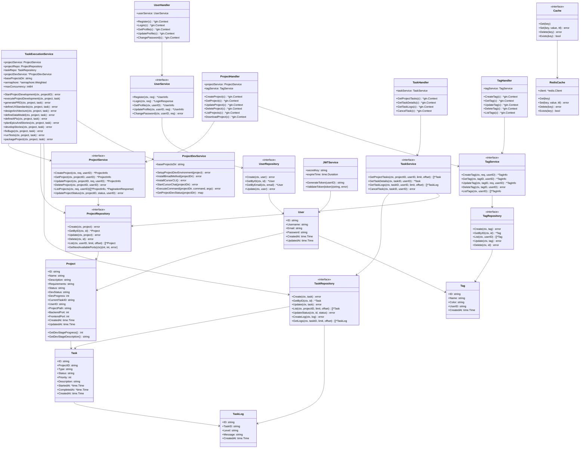

# AutoCodeWeb Backend

AutoCodeWeb 后端服务，基于 Go + Gin + GORM + PostgreSQL + Redis 构建的多Agent协作系统。

## 技术栈

- **语言**: Go 1.21+
- **Web框架**: Gin 1.9+
- **ORM**: GORM 1.25+
- **数据库**: PostgreSQL 15+
- **缓存**: Redis 7+
- **配置管理**: Viper
- **日志**: Zap
- **认证**: JWT

## 项目结构

```
backend/
├── cmd/                    # 应用程序入口
│   └── server/            # 主服务入口
│       └── main.go        # 应用程序主入口点
├── internal/               # 内部包
│   ├── api/               # API层
│   │   ├── handlers/      # HTTP处理器
│   │   │   ├── cache_handler.go      # 缓存管理处理器
│   │   │   ├── project_handler.go    # 项目管理处理器
│   │   │   ├── tag_handler.go         # 标签管理处理器
│   │   │   ├── task_handler.go        # 任务管理处理器
│   │   │   └── user_handler.go        # 用户管理处理器
│   │   ├── middleware/    # 中间件
│   │   │   ├── auth.go                # 认证中间件
│   │   │   ├── cors.go                # CORS中间件
│   │   │   └── logger.go              # 日志中间件
│   │   └── routes/        # 路由定义
│   │       ├── project_routes.go      # 项目相关路由
│   │       ├── routes.go              # 主路由注册
│   │       ├── task_routes.go         # 任务相关路由
│   │       ├── tag_routes.go          # 标签相关路由
│   │       └── user_routes.go         # 用户相关路由
│   ├── config/            # 配置管理
│   │   └── config.go      # 配置结构定义
│   ├── database/          # 数据库相关
│   │   ├── connection.go  # 数据库连接管理
│   │   └── seeds.go       # 数据库种子数据
│   ├── models/            # 数据模型
│   │   ├── common.go      # 通用模型和响应结构
│   │   ├── project.go      # 项目模型
│   │   ├── tag.go         # 标签模型
│   │   ├── task.go        # 任务模型
│   │   └── user.go        # 用户模型
│   ├── repositories/      # 数据访问层
│   │   ├── project_repository.go      # 项目数据访问
│   │   ├── tag_repository.go         # 标签数据访问
│   │   ├── task_repository.go        # 任务数据访问
│   │   ├── task_log_repository.go    # 任务日志数据访问
│   │   ├── user_repository.go        # 用户数据访问
│   │   └── user_session_repository.go # 用户会话数据访问
│   ├── services/          # 业务逻辑层
│   │   ├── project_service.go        # 项目管理服务
│   │   ├── project_template_service.go # 项目模板服务
│   │   ├── project_name_generator.go  # 项目名称生成器
│   │   ├── project_dev_service.go    # 项目开发环境服务
│   │   ├── task_service.go           # 任务查询服务
│   │   ├── task_execution_service.go # 异步任务执行服务
│   │   ├── tag_service.go            # 标签管理服务
│   │   └── user_service.go           # 用户管理服务
│   ├── utils/             # 工具类
│   │   ├── password_utils.go         # 密码工具
│   │   └── zip_utils.go              # 压缩工具
│   └── worker/            # 后台工作进程
├── pkg/                    # 可导出的包
│   ├── auth/              # 认证相关
│   │   └── jwt.go         # JWT认证服务
│   ├── cache/             # 缓存管理
│   │   ├── factory.go     # 缓存工厂
│   │   ├── interface.go   # 缓存接口定义
│   │   ├── keys.go        # 缓存键管理
│   │   ├── monitor.go     # 缓存监控
│   │   ├── redis.go       # Redis缓存实现
│   │   └── cache_test.go  # 缓存测试
│   ├── logger/            # 日志管理
│   │   └── logger.go      # 结构化日志
│   └── validator/         # 数据验证
├── configs/                # 配置文件
│   ├── config.yaml        # 开发环境配置
│   └── config.prod.yaml   # 生产环境配置
├── data/                   # 数据文件
│   ├── template/          # 项目模板
│   └── template.zip       # 压缩的项目模板
├── docs/                   # 文档
│   ├── docs.go            # Swagger文档
│   ├── swagger.json       # Swagger JSON
│   └── swagger.yaml       # Swagger YAML
├── scripts/                # 脚本文件
│   ├── project-dev-setup.sh # 项目开发环境设置脚本
│   ├── backup-db.sh        # 数据库备份脚本
│   ├── deploy.sh           # 部署脚本
│   ├── jenkins-build.sh    # Jenkins构建脚本
│   ├── init-db.sql         # 数据库初始化SQL
│   └── config-validator.go # 配置验证工具
├── logs/                   # 日志文件
│   └── app.log            # 应用日志
├── bmad-config/           # BMad-Method配置
├── bin/                    # 编译输出
│   └── server             # 可执行文件
├── go.mod                 # Go模块文件
├── go.sum                 # Go依赖校验
├── Dockerfile             # Docker 构建文件
├── Dockerfile.prod        # 生产环境Docker文件
├── docker-compose.yml     # Docker Compose配置
├── docker-compose.prod.yml # 生产环境Docker Compose
├── .dockerignore          # Docker 忽略文件
├── Jenkinsfile            # Jenkins CI/CD配置
├── Makefile               # 构建脚本
├── DATA_DIRECTORIES.md    # 数据目录说明
├── README-DEPLOYMENT.md   # 部署说明
└── ReadMe.md              # 项目说明
```

## 核心架构

### 分层架构
```
┌─────────────────────────────────────┐
│              API Layer              │  ← HTTP处理器和路由
├─────────────────────────────────────┤
│           Service Layer             │  ← 业务逻辑层
├─────────────────────────────────────┤
│         Repository Layer            │  ← 数据访问层
├─────────────────────────────────────┤
│           Model Layer               │  ← 数据模型层
└─────────────────────────────────────┘
```

### 异步任务架构
```
┌─────────────────────────────────────┐
│        TaskExecutionService         │  ← 异步任务执行服务
├─────────────────────────────────────┤
│         ProjectDevService           │  ← 项目开发环境服务
├─────────────────────────────────────┤
│           Cursor CLI               │  ← AI驱动的代码生成
└─────────────────────────────────────┘
```

## UML 类图



## 核心功能

### 1. 项目管理
- 项目创建、查询、更新、删除
- 项目状态管理（草稿、进行中、完成、失败）
- 项目开发进度跟踪
- 项目模板初始化

### 2. 异步任务执行
- 多阶段项目开发流程
- 并发控制（最多3个并发任务）
- AI驱动的代码生成（Cursor CLI）
- 实时任务状态和日志记录

### 3. 用户管理
- 用户注册、登录、认证
- JWT令牌管理
- 用户会话管理

### 4. 标签管理
- 项目标签创建和管理
- 标签颜色和分类

### 5. 缓存管理
- Redis缓存集成
- 缓存监控和统计
- 性能优化

## 技术栈

- **语言**: Go 1.24
- **Web框架**: Gin
- **ORM**: GORM
- **数据库**: PostgreSQL
- **缓存**: Redis
- **认证**: JWT
- **文档**: Swagger
- **容器化**: Docker
- **CI/CD**: Jenkins
- **AI工具**: Cursor CLI, BMad-Method

## 开发环境

### 前置要求
- Go 1.24+
- Docker & Docker Compose
- PostgreSQL
- Redis

### 快速开始
```bash
# 克隆项目
git clone <repository-url>
cd backend

# 安装依赖
go mod download

# 启动数据库和Redis
docker-compose up -d postgres redis

# 运行应用
go run cmd/server/main.go

# 访问Swagger文档
open http://localhost:8080/swagger/index.html
```

### 构建和部署
```bash
# 开发环境构建
make build

# 生产环境构建
make build-prod

# Docker构建
docker build -t autocodeweb-backend .

# 使用Docker Compose启动
docker-compose up -d
```

## API文档

启动服务后访问 `http://localhost:8080/swagger/index.html` 查看完整的API文档。

### 主要API端点

#### 项目管理
- `GET /api/v1/projects` - 获取项目列表
- `POST /api/v1/projects` - 创建新项目
- `GET /api/v1/projects/{id}` - 获取项目详情
- `PUT /api/v1/projects/{id}` - 更新项目
- `DELETE /api/v1/projects/{id}` - 删除项目

#### 任务管理
- `GET /api/v1/projects/{projectId}/tasks` - 获取项目任务列表
- `GET /api/v1/projects/{projectId}/tasks/{taskId}` - 获取任务详情
- `GET /api/v1/projects/{projectId}/tasks/{taskId}/logs` - 获取任务日志
- `POST /api/v1/projects/{projectId}/tasks/{taskId}/cancel` - 取消任务

#### 用户管理
- `POST /api/v1/auth/register` - 用户注册
- `POST /api/v1/auth/login` - 用户登录
- `GET /api/v1/auth/profile` - 获取用户信息
- `PUT /api/v1/auth/profile` - 更新用户信息

#### 标签管理
- `GET /api/v1/tags` - 获取标签列表
- `POST /api/v1/tags` - 创建标签
- `PUT /api/v1/tags/{id}` - 更新标签
- `DELETE /api/v1/tags/{id}` - 删除标签

## 配置说明

### 环境变量
- `DB_HOST`: 数据库主机
- `DB_PORT`: 数据库端口
- `DB_NAME`: 数据库名称
- `DB_USER`: 数据库用户
- `DB_PASSWORD`: 数据库密码
- `REDIS_HOST`: Redis主机
- `REDIS_PORT`: Redis端口
- `JWT_SECRET`: JWT密钥
- `JWT_EXPIRE`: JWT过期时间（小时）

### 配置文件
- `configs/config.yaml`: 开发环境配置
- `configs/config.prod.yaml`: 生产环境配置

## 监控和日志

### 日志
- 结构化日志输出
- 日志级别：DEBUG, INFO, WARN, ERROR
- 日志文件：`logs/app.log`

### 监控
- 缓存性能监控
- 数据库连接监控
- 任务执行状态监控

## 贡献指南

1. Fork 项目
2. 创建功能分支 (`git checkout -b feature/AmazingFeature`)
3. 提交更改 (`git commit -m 'Add some AmazingFeature'`)
4. 推送到分支 (`git push origin feature/AmazingFeature`)
5. 打开 Pull Request

## 许可证

本项目采用 MIT 许可证 - 查看 [LICENSE](LICENSE) 文件了解详情。
