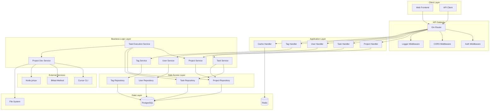
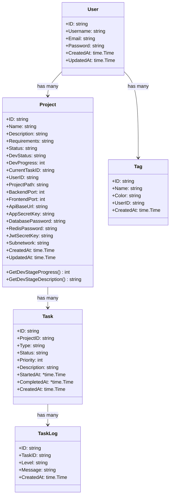
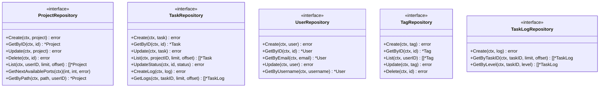
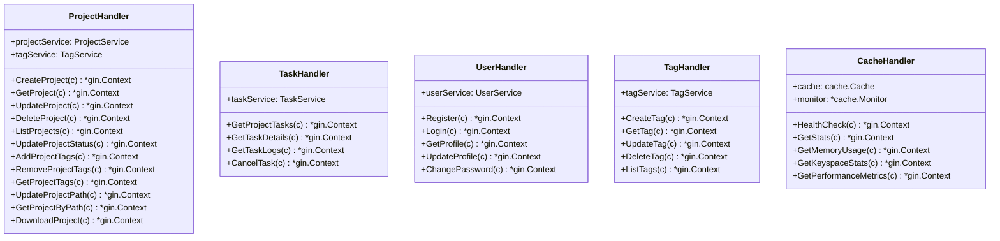
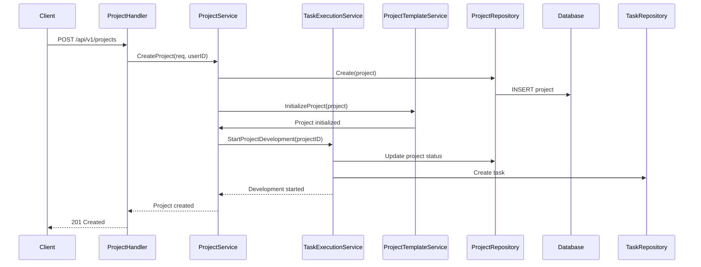
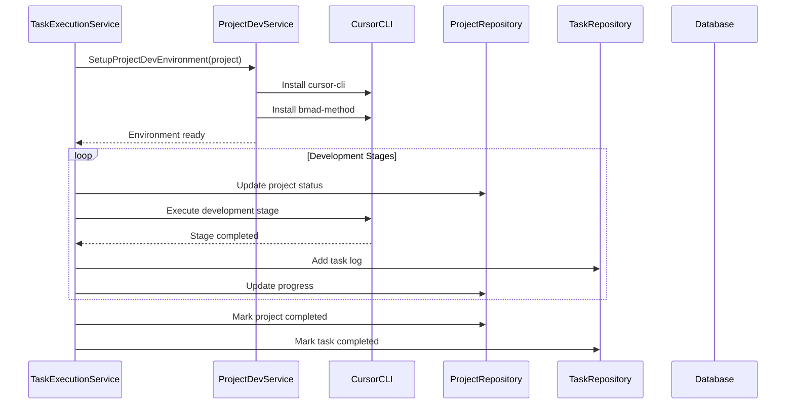
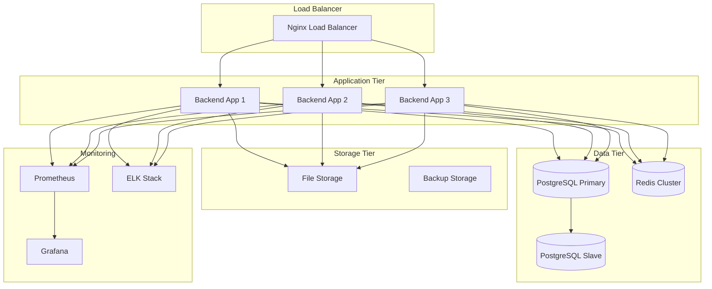

# AutoCodeWeb Backend Architecture

## 系统架构概览

AutoCodeWeb 后端采用分层架构设计，结合异步任务处理机制，实现多Agent协作的智能项目开发系统。

## 核心架构图



## 详细 UML 类图

### 1. 核心模型层



### 2. 数据访问层



### 3. 业务逻辑层

```mermaid
classDiagram
    class ProjectService {
        <<interface>>
        +CreateProject(ctx, req, userID) *ProjectInfo
        +GetProject(ctx, projectID, userID) *ProjectInfo
        +UpdateProject(ctx, projectID, req, userID) *ProjectInfo
        +DeleteProject(ctx, projectID, userID) error
        +ListProjects(ctx, req, userID) ([]*ProjectInfo, *PaginationResponse)
        +UpdateProjectStatus(ctx, projectID, status, userID) error
        +GetProjectsByStatus(ctx, status, userID) []*ProjectInfo
        +AddProjectTags(ctx, projectID, tagIDs, userID) error
        +RemoveProjectTags(ctx, projectID, tagIDs, userID) error
        +GetProjectTags(ctx, projectID, userID) []*TagInfo
        +UpdateProjectPath(ctx, projectID, path, userID) error
        +GetProjectByPath(ctx, path, userID) *ProjectInfo
        +DownloadProject(ctx, projectID, userID) []byte
    }

    class TaskService {
        <<interface>>
        +GetProjectTasks(ctx, projectID, userID, limit, offset) []*Task
        +GetTaskDetails(ctx, taskID, userID) *Task
        +GetTaskLogs(ctx, taskID, userID, limit, offset) []*TaskLog
        +CancelTask(ctx, taskID, userID) error
    }

    class TaskExecutionService {
        +projectService: ProjectService
        +projectRepo: ProjectRepository
        +taskRepo: TaskRepository
        +projectDevService: *ProjectDevService
        +baseProjectsDir: string
        +semaphore: *semaphore.Weighted
        +maxConcurrency: int64
        +mu: sync.Mutex
        +StartProjectDevelopment(ctx, projectID) error
        +executeWithSemaphore(ctx, project, task)
        +executeProjectDevelopment(ctx, project, task)
        +generatePRD(ctx, project, task) error
        +defineUXStandards(ctx, project, task) error
        +designArchitecture(ctx, project, task) error
        +defineDataModel(ctx, project, task) error
        +defineAPIs(ctx, project, task) error
        +planEpicsAndStories(ctx, project, task) error
        +developStories(ctx, project, task) error
        +fixBugs(ctx, project, task) error
        +runTests(ctx, project, task) error
        +packageProject(ctx, project, task) error
        +addTaskLog(ctx, taskID, level, message)
    }

    class ProjectDevService {
        +baseProjectsDir: string
        +SetupProjectDevEnvironment(project) error
        +InstallBmadMethod(projectDir) error
        +InstallCursorCLI() error
        +StartCursorChat(projectDir) error
        +ExecuteCommand(projectDir, command, args) error
        +GetProjectDevStatus(projectDir) map[string]interface{}
        +isBmadMethodInstalled(projectDir) bool
        +isCursorCLIInstalled() bool
        +isNodeInstalled() bool
        +isNpmInstalled() bool
        +getNodeVersion() string
        +getNpmVersion() string
    }

    class ProjectTemplateService {
        +templatePath: string
        +InitializeProject(project) error
        +extractTemplate() error
        +copyTemplateFiles(projectPath) error
        +updateProjectConfig(project) error
        +createDockerCompose(project) error
        +createNginxConfig(project) error
    }

    class ProjectNameGenerator {
        +GenerateProjectConfig(requirements, config) bool
        +generateProjectName(requirements) string
        +generateDescription(requirements) string
        +generateApiBaseUrl() string
        +generateSecretKey() string
        +generateDatabasePassword() string
        +generateRedisPassword() string
        +generateJwtSecretKey() string
    }

    class UserService {
        <<interface>>
        +Register(ctx, req) *UserInfo
        +Login(ctx, req) *LoginResponse
        +GetProfile(ctx, userID) *UserInfo
        +UpdateProfile(ctx, userID, req) *UserInfo
        +ChangePassword(ctx, userID, req) error
        +ValidateToken(token) (string, error)
    }

    class TagService {
        <<interface>>
        +CreateTag(ctx, req, userID) *TagInfo
        +GetTag(ctx, tagID, userID) *TagInfo
        +UpdateTag(ctx, tagID, req, userID) *TagInfo
        +DeleteTag(ctx, tagID, userID) error
        +ListTags(ctx, userID) []*TagInfo
    }
```

### 4. API 控制器层



### 5. 中间件和工具层

```mermaid
classDiagram
    class JWTService {
        +secretKey: string
        +expireTime: time.Duration
        +GenerateToken(userID) string
        +ValidateToken(token) (string, error)
        +RefreshToken(token) string
    }

    class AuthMiddleware {
        +jwtService: *JWTService
        +AuthMiddleware(jwtService) gin.HandlerFunc
        +extractToken(c) string
        +validateToken(token) (string, error)
    }

    class CORSMiddleware {
        +CORS() gin.HandlerFunc
    }

    class LoggerMiddleware {
        +Logger() gin.HandlerFunc
        +logRequest(c) *gin.Context
    }

    class Cache {
        <<interface>>
        +Get(key) interface{}
        +Set(key, value, ttl) error
        +Delete(key) error
        +Exists(key) bool
        +Incr(key) int64
        +Decr(key) int64
        +Expire(key, ttl) error
    }

    class RedisCache {
        +client: *redis.Client
        +Get(key) interface{}
        +Set(key, value, ttl) error
        +Delete(key) error
        +Exists(key) bool
        +Incr(key) int64
        +Decr(key) int64
        +Expire(key, ttl) error
    }

    class CacheFactory {
        +CreateCache(config) cache.Cache
        +createRedisCache(config) *RedisCache
    }

    class CacheMonitor {
        +cache: cache.Cache
        +GetStats() *Stats
        +GetMemoryUsage() *MemoryUsage
        +GetKeyspaceStats() *KeyspaceStats
        +GetPerformanceMetrics() *PerformanceMetrics
    }

    class Logger {
        +Info(msg, fields...)
        +Error(msg, fields...)
        +Warn(msg, fields...)
        +Debug(msg, fields...)
        +String(key, value) Field
        +Int(key, value) Field
        +Error(key, err) Field
    }
```

## 数据流图

### 项目创建流程



### 异步任务执行流程



## 部署架构



## 技术决策说明

### 1. 分层架构
- **API层**: 处理HTTP请求，参数验证，响应格式化
- **服务层**: 业务逻辑处理，事务管理
- **仓库层**: 数据访问抽象，支持多种数据源
- **模型层**: 数据结构定义，业务规则封装

### 2. 异步任务处理
- **信号量控制**: 限制并发任务数量，防止资源耗尽
- **状态机**: 清晰的任务状态转换，便于监控和调试
- **日志记录**: 详细的任务执行日志，支持问题排查

### 3. AI集成
- **Cursor CLI**: 作为主要的AI代码生成工具
- **BMad-Method**: 提供结构化的开发方法论
- **Node.js环境**: 支持现代前端开发工具链

### 4. 缓存策略
- **Redis**: 高性能缓存，支持复杂数据结构
- **监控**: 实时缓存性能监控，支持容量规划
- **分层缓存**: 支持多级缓存策略

### 5. 安全设计
- **JWT认证**: 无状态认证，支持分布式部署
- **权限控制**: 基于用户的项目访问控制
- **输入验证**: 严格的参数验证和SQL注入防护

## 性能考虑

### 1. 数据库优化
- 索引优化：为常用查询字段建立索引
- 连接池：复用数据库连接，减少连接开销
- 读写分离：支持主从数据库架构

### 2. 缓存策略
- 热点数据缓存：项目信息、用户会话等
- 缓存预热：系统启动时预加载关键数据
- 缓存失效：合理的TTL设置，保证数据一致性

### 3. 异步处理
- 非阻塞操作：耗时操作异步处理
- 并发控制：防止资源竞争和系统过载
- 任务队列：支持任务优先级和重试机制

## 扩展性设计

### 1. 水平扩展
- 无状态设计：支持多实例部署
- 负载均衡：支持多种负载均衡策略
- 数据分片：支持大规模数据存储

### 2. 功能扩展
- 插件架构：支持功能模块化扩展
- 配置驱动：支持运行时配置变更
- API版本管理：支持API向后兼容

### 3. 集成能力
- 标准化接口：支持第三方系统集成
- Webhook支持：支持事件驱动集成
- 消息队列：支持异步消息处理
