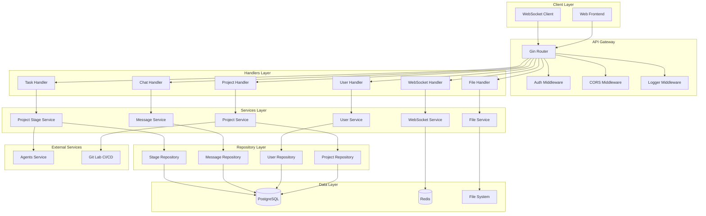
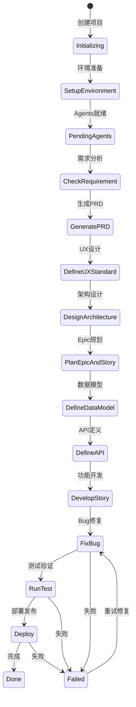
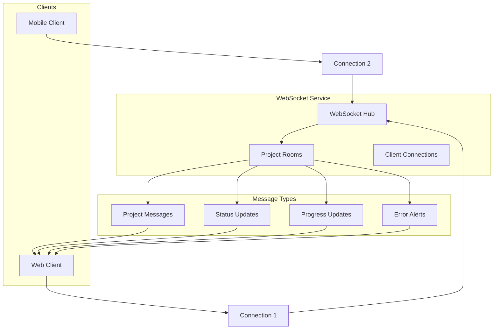
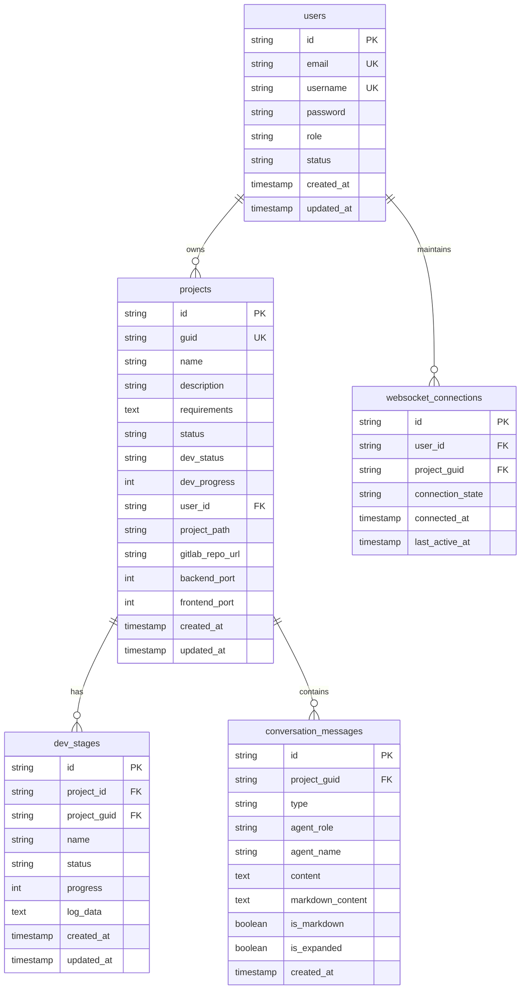
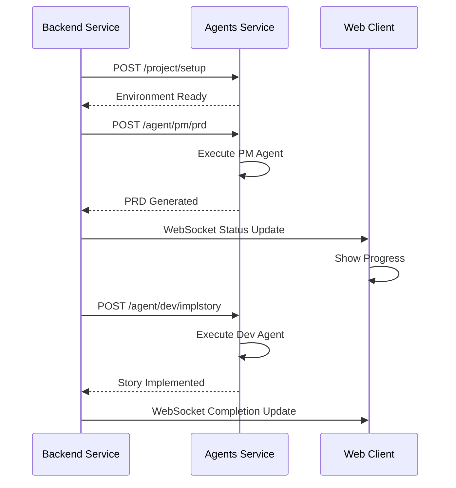
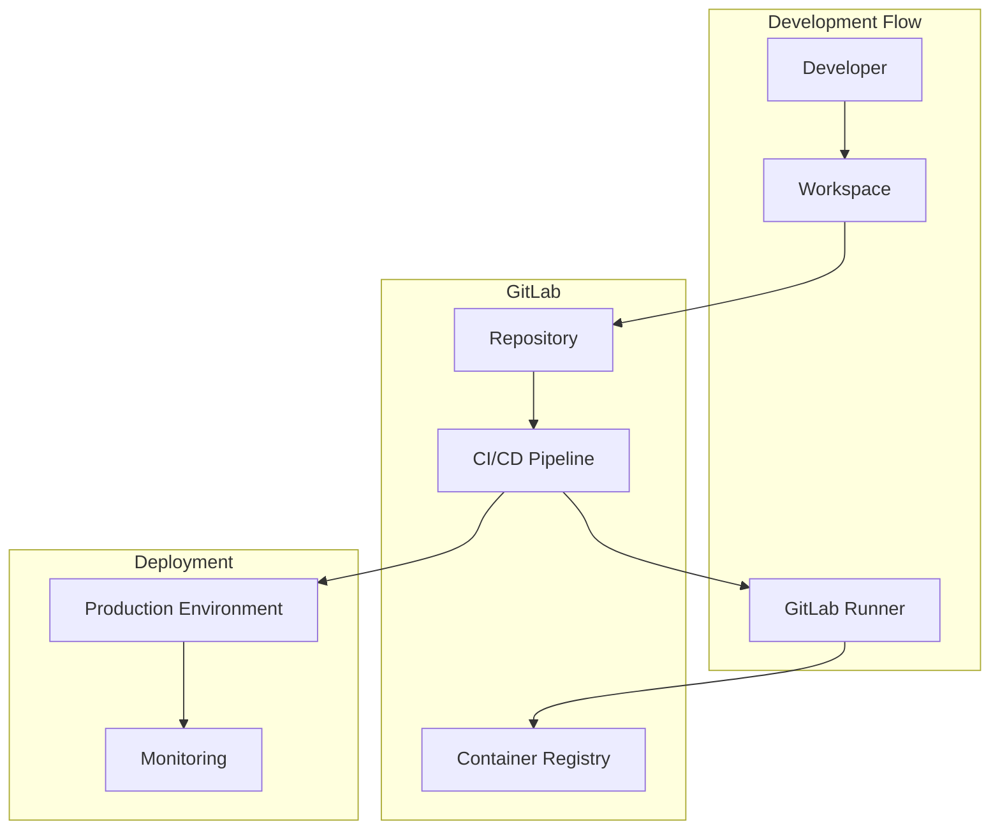

# App Maker Backend 架构设计

## 系统架构概览

App Maker Backend 采用分层架构设计，通过异步任务处理机制和Agent服务集成，实现多Agent协作的智能项目开发平台。

## 核心架构图

## 开发阶段管理

系统支持完整的项目开发生命周期管理：

## WebSocket 实时通信架构

## 数据模型关系

## Agent 集成架构

## GitLab CI/CD 集成

## 技术栈说明

### 数据持久化
- **PostgreSQL**: 主数据库，支持ACID事务
- **Redis**: 缓存和会话存储，支持发布订阅
- **GORM**: ORM框架，支持数据库迁移和关联查询

### 异步处理
- **Asynq**: 基于Redis的任务队列，支持任务重试和调度
- **Goroutines**: Go原生并发，支持高并发处理

### API与通信
- **Gin**: 高性能HTTP框架，中间件丰富
- **WebSocket**: 实时双向通信，支持房间管理
- **JWT**: 无状态认证，支持分布式部署

### 外部集成
- **Agents Service**: AI Agent服务，通过HTTP API调用
- **GitLab**: 代码仓库和CI/CD流水线
- **Docker**: 容器化部署，支持多环境

---
## 联系方式

- 维护者: AI探趣星船长（抖音、小红书、B站同名）
- 邮箱: qqjack2012@gmail.com
- 项目地址: https://github.com/lighthought/app-maker
