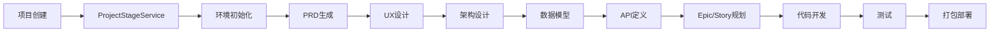
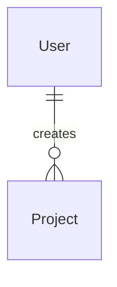

# AutoCodeWeb Backend - 快速参考

## 项目概览

AutoCodeWeb 是一个基于 Go 的智能项目开发平台，通过多Agent协作实现自动化代码生成和项目开发。

## 核心特性

- 🚀 **异步任务处理**: 支持多阶段项目开发流程
- 🤖 **AI驱动开发**: 集成 Cursor CLI 和 BMad-Method
- 📊 **实时监控**: 任务状态和进度跟踪
- 🔐 **安全认证**: JWT 认证和权限控制
- 🗄️ **数据持久化**: PostgreSQL + Redis 缓存
- 📚 **API文档**: 自动生成 Swagger 文档

## 技术栈

| 层级 | 技术 | 说明 |
|------|------|------|
| 语言 | Go 1.24 | 高性能后端语言 |
| Web框架 | Gin | 轻量级HTTP框架 |
| ORM | GORM | Go ORM库 |
| 数据库 | PostgreSQL | 主数据库 |
| 缓存 | Redis | 高性能缓存 |
| 认证 | JWT | 无状态认证 |
| 文档 | Swagger | API文档生成 |
| 容器 | Docker | 容器化部署 |
| CI/CD | Jenkins | 持续集成 |

## 项目结构

```
backend/
├── cmd/server/main.go          # 应用入口
├── internal/
│   ├── api/                   # API层
│   │   ├── handlers/          # HTTP处理器
│   │   ├── middleware/        # 中间件
│   │   └── routes/            # 路由定义
│   ├── services/              # 业务逻辑层
│   │   ├── project_service.go
│   │   ├── task_service.go
│   │   ├── task_execution_service.go  # 异步任务执行
│   │   └── project_dev_service.go    # 开发环境管理
│   ├── repositories/          # 数据访问层
│   ├── models/                # 数据模型
│   └── config/                # 配置管理
├── pkg/                       # 公共包
│   ├── auth/                  # JWT认证
│   ├── cache/                 # Redis缓存
│   └── logger/                # 日志管理
└── docs/                      # Swagger文档
```

## 核心组件

### 1. 异步任务执行系统



### 2. 数据模型关系



### 3. API端点概览

| 功能模块 | 主要端点 | 说明 |
|----------|----------|------|
| 项目管理 | `/api/v1/projects` | 项目CRUD操作 |
| 任务管理 | `/api/v1/projects/{id}/tasks` | 任务查询和取消 |
| 用户管理 | `/api/v1/auth/*` | 注册、登录、认证 |
| 标签管理 | `/api/v1/tags` | 标签CRUD操作 |
| 缓存监控 | `/api/v1/cache/*` | 缓存状态监控 |

## 开发流程

### 1. 项目创建流程

1. **用户提交需求** → `POST /api/v1/projects`
2. **系统生成配置** → 自动生成项目名称、端口等
3. **初始化模板** → 解压项目模板到指定目录
4. **启动异步任务** → 开始多阶段开发流程
5. **返回项目信息** → 包含项目ID和状态

### 2. 异步开发流程

1. **环境处理** → 安装 Node.js、Cursor CLI、BMad-Method
2. **PRD生成** → 基于需求生成产品需求文档
3. **UX设计** → 定义用户体验标准
4. **架构设计** → 设计系统架构和技术栈
5. **数据建模** → 定义数据库结构
6. **API设计** → 定义接口规范
7. **Epic规划** → 划分功能模块和用户故事
8. **代码开发** → 实际代码实现
9. **问题修复** → 代码审查和问题修复
10. **测试执行** → 自动化测试
11. **项目打包** → Docker配置和部署脚本

## 配置说明

### 环境变量

```bash
# 数据库配置
DB_HOST=localhost
DB_PORT=5432
DB_NAME=autocodeweb
DB_USER=postgres
DB_PASSWORD=password

# Redis配置
REDIS_HOST=localhost
REDIS_PORT=6379

# JWT配置
JWT_SECRET=your-secret-key
JWT_EXPIRE=24

# 应用配置
APP_PORT=8080
APP_ENVIRONMENT=development
```

### 配置文件

- `configs/config.yaml` - 开发环境配置
- `configs/config.prod.yaml` - 生产环境配置

## 部署指南

### 开发环境

```bash
# 启动依赖服务
docker-compose up -d postgres redis

# 运行应用
go run cmd/server/main.go

# 访问API文档
open http://localhost:8080/swagger/index.html
```

### 生产环境

```bash
# 构建镜像
docker build -t autocodeweb-backend .

# 使用Docker Compose部署
docker-compose -f docker-compose.prod.yml up -d
```

## 监控和日志

### 日志级别

- `DEBUG` - 调试信息
- `INFO` - 一般信息
- `WARN` - 警告信息
- `ERROR` - 错误信息

### 监控指标

- 任务执行状态
- 缓存性能指标
- 数据库连接状态
- API响应时间

## 扩展开发

### 添加新的开发阶段

1. 在 `ProjectStageService` 中添加新的阶段方法
2. 在 `Project` 模型中添加对应的状态常量
3. 更新 `GetDevStageProgress()` 方法
4. 在开发流程数组中添加新阶段

### 添加新的API端点

1. 在对应的 Handler 中添加处理方法
2. 添加 Swagger 注释
3. 在路由文件中注册路由
4. 更新服务层和仓库层

### 添加新的数据模型

1. 在 `models/` 目录下创建模型文件
2. 在 `repositories/` 目录下创建仓库接口和实现
3. 在 `services/` 目录下创建服务接口和实现
4. 在 `handlers/` 目录下创建处理器

## 故障排除

### 常见问题

1. **任务执行失败**
   - 检查 Cursor CLI 是否正确安装
   - 检查项目目录权限
   - 查看任务日志获取详细错误信息

2. **数据库连接失败**
   - 检查数据库服务是否启动
   - 验证连接配置是否正确
   - 检查网络连接

3. **缓存连接失败**
   - 检查 Redis 服务是否启动
   - 验证 Redis 配置
   - 检查网络连接

### 调试技巧

1. **查看应用日志**
   ```bash
   tail -f logs/app.log
   ```

2. **查看任务日志**
   ```bash
   # 通过API获取任务日志
   GET /api/v1/projects/{projectId}/tasks/{taskId}/logs
   ```

3. **监控缓存状态**
   ```bash
   # 通过API获取缓存状态
   GET /api/v1/cache/stats
   ```

## 贡献指南

1. Fork 项目
2. 创建功能分支
3. 提交更改
4. 推送到分支
5. 创建 Pull Request

## 许可证

MIT License
