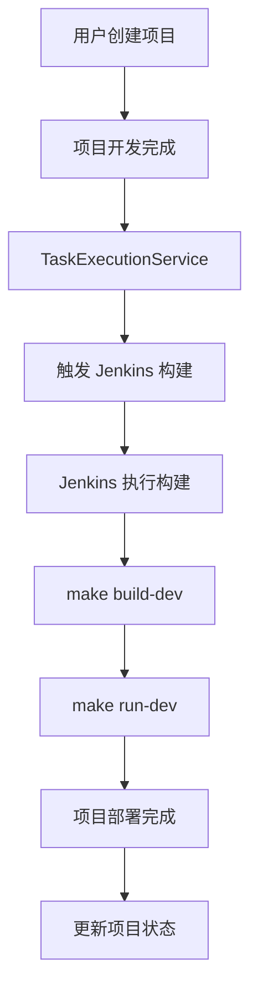

# Jenkins CI/CD 集成配置指南

## 概述

本文档描述了如何在 AutoCodeWeb 项目中集成 Jenkins CI/CD，实现项目开发完成后的自动构建和部署。

## 架构流程



## Jenkins 配置

### 1. Jenkins 任务配置

**任务名称**: `app-maker-flow`

**任务类型**: Pipeline 或 Freestyle

**参数化构建**:
- `USER_ID` (String): 用户ID
- `PROJECT_ID` (String): 项目ID  
- `PROJECT_PATH` (String): 项目路径
- `BUILD_TYPE` (Choice): 构建类型 (dev/prod)

### 2. Jenkins Pipeline 脚本

```groovy
pipeline {
    agent any
    
    parameters {
        string(name: 'USER_ID', description: '用户ID')
        string(name: 'PROJECT_ID', description: '项目ID')
        string(name: 'PROJECT_PATH', description: '项目路径')
        choice(name: 'BUILD_TYPE', choices: ['dev', 'prod'], description: '构建类型')
    }
    
    stages {
        stage('Check Project') {
            steps {
                script {
                    echo "开始构建项目: ${params.USER_ID}/${params.PROJECT_ID}"
                    echo "项目路径: ${params.PROJECT_PATH}"
                    echo "构建类型: ${params.BUILD_TYPE}"
                    
                    // 检查项目路径是否存在
                    if (!fileExists(params.PROJECT_PATH)) {
                        error "项目路径不存在: ${params.PROJECT_PATH}"
                    }
                }
            }
        }
        
        stage('Build Project') {
            steps {
                script {
                    echo "开始构建项目..."
                    
                    // 进入项目目录
                    dir(params.PROJECT_PATH) {
                        // 检查 Makefile 是否存在
                        if (!fileExists('Makefile')) {
                            error "项目目录中没有找到 Makefile"
                        }
                        
                        // 执行构建
                        if (params.BUILD_TYPE == 'prod') {
                            sh 'make build-prod'
                        } else {
                            sh 'make build-dev'
                        }
                    }
                }
            }
        }
        
        stage('Deploy Project') {
            steps {
                script {
                    echo "开始部署项目..."
                    
                    // 进入项目目录
                    dir(params.PROJECT_PATH) {
                        // 执行部署
                        if (params.BUILD_TYPE == 'prod') {
                            sh 'make run-prod'
                        } else {
                            sh 'make run-dev'
                        }
                    }
                }
            }
        }
        
        stage('Health Check') {
            steps {
                script {
                    echo "执行健康检查..."
                    
                    // 等待服务启动
                    sleep 30
                    
                    // 检查服务状态
                    sh '''
                        if docker ps | grep -q "${PROJECT_ID}"; then
                            echo "✅ 项目部署成功"
                        else
                            echo "❌ 项目部署失败"
                            exit 1
                        fi
                    '''
                }
            }
        }
    }
    
    post {
        success {
            script {
                echo "✅ 项目构建和部署成功"
                
                // 通知 AutoCodeWeb 后端
                sh '''
                    curl -X POST "http://backend:8080/api/v1/projects/${PROJECT_ID}/deployment-status" \
                        -H "Content-Type: application/json" \
                        -d "{\"status\":\"deployed\",\"jenkins_build\":\"${BUILD_NUMBER}\"}"
                '''
            }
        }
        
        failure {
            script {
                echo "❌ 项目构建或部署失败"
                
                // 通知 AutoCodeWeb 后端
                sh '''
                    curl -X POST "http://backend:8080/api/v1/projects/${PROJECT_ID}/deployment-status" \
                        -H "Content-Type: application/json" \
                        -d "{\"status\":\"failed\",\"jenkins_build\":\"${BUILD_NUMBER}\"}"
                '''
            }
        }
    }
}
```

## 后端集成

### 1. 环境变量配置

在 `.env` 文件中添加：

```bash
# Jenkins 配置
JENKINS_URL=http://10.0.0.6:5016
JENKINS_USERNAME=admin
JENKINS_API_TOKEN=your_api_token_here
JENKINS_JOB_NAME=app-maker-flow
```

### 2. API Token 获取

1. 登录 Jenkins: `http://10.0.0.6:5016`
2. 点击用户名 → Configure
3. 在 API Token 部分点击 "Add new Token"
4. 复制生成的 Token

### 3. CSRF 保护配置

如果遇到 "No valid crumb" 错误，需要：

1. 在 Jenkins 中禁用 CSRF 保护：
   - Manage Jenkins → Configure Global Security
   - 取消勾选 "Enable proxy compatibility"
   - 取消勾选 "Prevent Cross Site Request Forgery exploits"

2. 或者使用 Crumb API：
   ```bash
   # 获取 Crumb
   CRUMB=$(curl -s "http://10.0.0.6:5016/crumbIssuer/api/xml?xpath=concat(//crumbRequestField,\":\",//crumb)")
   
   # 使用 Crumb 发送请求
   curl -X POST "http://10.0.0.6:5016/job/app-maker-flow/buildWithParameters" \
        -H "$CRUMB" \
        -H "Content-Type: application/x-www-form-urlencoded" \
        -d "USER_ID=test&PROJECT_ID=test"
   ```

## 使用方法

### 1. 自动触发

项目开发完成后，`TaskExecutionService` 会自动触发 Jenkins 构建：

```go
// 在项目开发完成后自动触发
go s.triggerJenkinsBuild(context.Background(), project, task)
```

### 2. 手动触发

使用脚本手动触发：

```bash
./backend/scripts/jenkins-trigger.sh \
    --user-id USER123 \
    --project-id PROJ456 \
    --project-path /app/data/projects/USER123/PROJ456 \
    --build-type dev
```

### 3. API 触发

直接调用 Jenkins API：

```bash
curl -X POST "http://10.0.0.6:5016/job/app-maker-flow/buildWithParameters" \
     -H "Content-Type: application/x-www-form-urlencoded" \
     -d "USER_ID=USER123&PROJECT_ID=PROJ456&PROJECT_PATH=/app/data/projects/USER123/PROJ456&BUILD_TYPE=dev"
```

## 监控和调试

### 1. 查看 Jenkins 构建日志

访问: `http://10.0.0.6:5016/job/app-maker-flow/`

### 2. 查看后端日志

```bash
docker logs app-maker-backend-dev
```

### 3. 检查项目状态

```bash
make jenkins-status
```

## 故障排除

### 1. Jenkins 连接失败

- 检查 Jenkins URL 是否正确
- 检查网络连接
- 验证 API Token

### 2. 项目构建失败

- 检查项目路径是否存在
- 检查 Makefile 是否存在
- 查看 Jenkins 构建日志

### 3. 权限问题

- 确保 Jenkins 有访问项目目录的权限
- 检查 Docker 权限
- 验证文件系统权限

## 扩展功能

### 1. 多环境支持

- 开发环境: `make build-dev && make run-dev`
- 生产环境: `make build-prod && make run-prod`

### 2. 通知集成

- 邮件通知
- Slack 通知
- Webhook 回调

### 3. 部署策略

- 蓝绿部署
- 滚动更新
- 金丝雀发布
