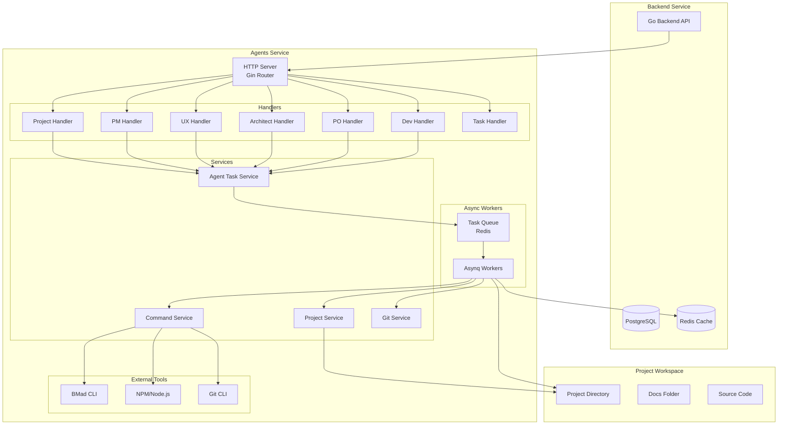
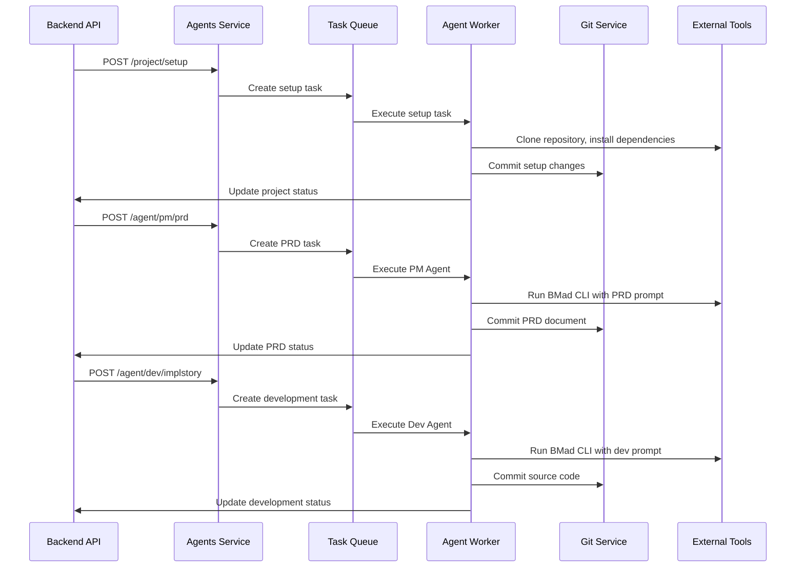
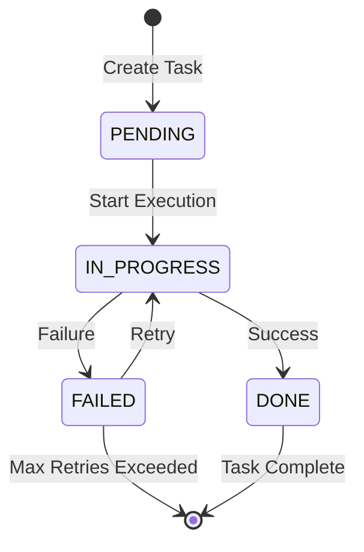
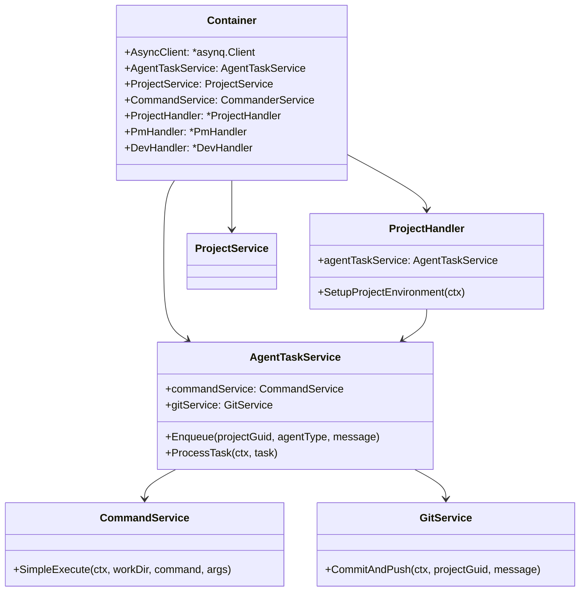

# App Maker Agents Service Architecture

## 1. Overview

**App Maker Agents Service** is a multi-Agent collaboration development service based on **Go + Gin + Asynq**. It provides a unified execution environment for automated software development. The service integrates with the backend system via HTTP APIs, supporting asynchronous task execution, real-time status feedback, and Git workflow management.

## 2. Technical Architecture

### 2.1 Core Framework
- **Go 1.24**: High-performance system programming language.
- **Gin**: Lightweight, high-performance Web framework.
- **Asynq**: Asynchronous task queue system based on Redis.
- **Zap**: High-performance structured logging library.
- **Swagger**: Automatic API documentation generation.

### 2.2 Infrastructure
- **Redis**: Task storage, caching, and queue management.
- **Git**: Version control and code commit management.
- **Shared Models**: `shared-models` module providing unified API interfaces and types.

## 3. System Architecture

### 3.1 Overall Architecture Diagram



## 4. Agent Collaboration Flow

### 4.1 Development Stage Flow



### 4.2 Task State Transition



## 5. API Design

### 5.1 REST API Endpoints

#### Project Management
```http
POST /api/v1/project/setup
```

#### Agent Task Interfaces
```http
POST /api/v1/agent/pm/prd                  # Generate PRD
POST /api/v1/agent/ux-expert/ux-standard   # UX Standard Design
POST /api/v1/agent/architect/architect     # Architecture Design
POST /api/v1/agent/po/epicsandstories      # Epics and Stories
POST /api/v1/agent/dev/implstory           # Implement Story
POST /api/v1/agent/dev/fixbug              # Fix Bug
```

#### Task Status Query
```http
GET /api/v1/tasks/{task_id}
```

## 6. Component Relationship



## 7. Summary

App Maker Agents Service adopts a modern microservices architecture with the following features:

1.  **High Performance**: Built on Go, supporting high concurrency.
2.  **Asynchronous Processing**: Uses Asynq for reliable task queues.
3.  **Modular Design**: Clear layering for easy maintenance.
4.  **Simple Integration**: Seamless integration with Backend via `shared-models`.
5.  **Toolchain Support**: Flexible integration with BMad CLI, Git, etc.
6.  **Error Handling**: Robust error handling and retry mechanisms.
7.  **Real-time Feedback**: Supports real-time task status queries and progress updates.
