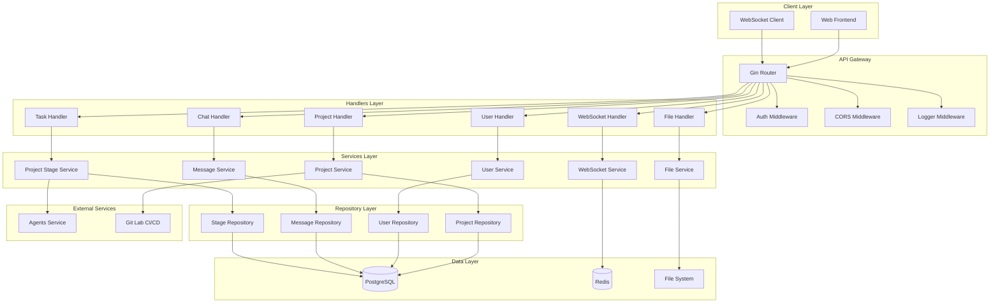
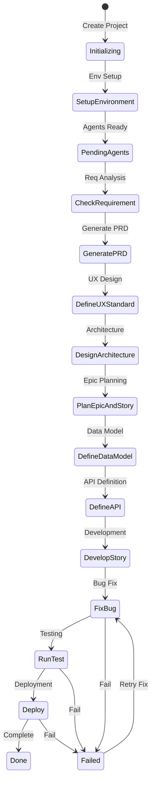
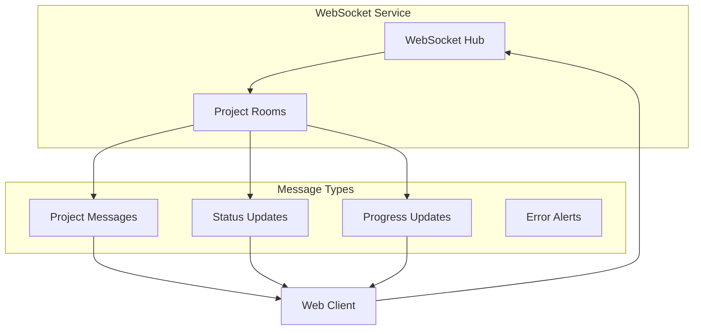
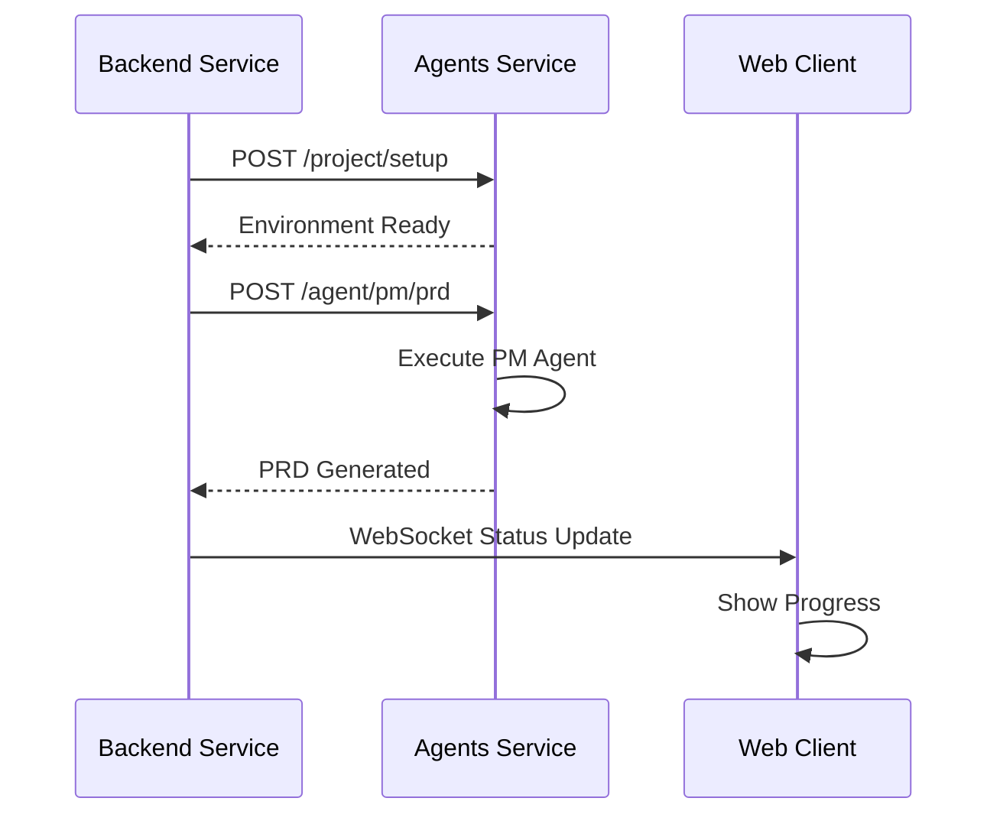

# App Maker Backend Architecture

## 1. Overview

**App Maker Backend** is a multi-Agent collaboration platform backend based on Go + Gin + GORM + PostgreSQL + Redis. It provides high-performance API services for the frontend, including project management, BMad-Method integration, and task execution.

### 1.1 Core Concepts
- **Microservices Architecture**: Services are divided by business domain, supporting independent deployment and scaling.
- **Layered Architecture**: Clear separation of concerns for easier maintenance and testing.
- **Event-Driven**: Asynchronous processing mechanism based on message queues (Redis Streams/Asynq).
- **RESTful API**: Standardized API design.
- **High Concurrency**: Leveraging Go's goroutines for high concurrency handling.

### 1.2 Technology Stack
- **Language**: Go 1.24+
- **Web Framework**: Gin 1.10+
- **ORM**: GORM 1.25+
- **Database**: PostgreSQL 15+
- **Cache**: Redis 7+
- **Task Queue**: Asynq + Redis
- **Configuration**: Viper
- **Logging**: Zap (via `shared-models/logger`)
- **Validation**: validator
- **JWT**: golang-jwt

## 2. System Architecture

### 2.1 Core Architecture Diagram



## 3. Project Structure

### 3.1 Directory Layout

```
backend/
├── cmd/                    # Application Entry Points
│   └── server/             # Main Server Entry
│       └── main.go
├── internal/               # Internal Packages (Private to this module)
│   ├── api/                # API Layer
│   │   ├── handlers/       # HTTP Handlers
│   │   ├── middleware/     # Gin Middleware
│   │   └── routes/         # Route Definitions
│   ├── config/             # Configuration Management
│   ├── container/          # Dependency Injection Container
│   ├── database/           # Database Connection & Init
│   ├── models/             # Domain Models (Specific to backend)
│   ├── repositories/       # Data Access Layer
│   └── services/           # Business Logic Layer
├── docs/                   # Swagger/OpenAPI Docs
├── scripts/                # Utility Scripts
├── .env                    # Environment Variables
├── go.mod                  # Go Module Definition
└── Dockerfile              # Docker Build File
```

> **Note**: Shared components such as `auth`, `logger`, `common` types, and `client` utilities are located in the `shared-models` module, not in a local `pkg` directory.

### 3.2 Layered Design

```
┌─────────────────────────────────────────────────────────────┐
│                        API Layer                            │
│               HTTP Handlers, Routes, Middleware             │
│               (internal/api)                                │
└─────────────────────────────────────────────────────────────┘
                                │
                                ▼
┌─────────────────────────────────────────────────────────────┐
│                      Service Layer                          │
│           Business Logic, Transactions, Rules               │
│               (internal/services)                           │
└─────────────────────────────────────────────────────────────┘
                                │
                                ▼
┌─────────────────────────────────────────────────────────────┐
│                    Repository Layer                         │
│           Data Access, Query Optimization                   │
│               (internal/repositories)                       │
└─────────────────────────────────────────────────────────────┘
                                │
                                ▼
┌─────────────────────────────────────────────────────────────┐
│                       Data Layer                            │
│           PostgreSQL, Redis, File System                    │
└─────────────────────────────────────────────────────────────┘
```

## 4. Key Components Implementation

### 4.1 Application Entry (`cmd/server/main.go`)

The entry point initializes configuration, logging, database connections, and the dependency injection container before starting the Gin server.

```go
func main() {
    cfg, err := loadConfigAndService()
    if err != nil {
        logger.Fatal("Failed to load config or connect to services", logger.String("error", err.Error()))
        os.Exit(1)
    }

    container, engine := setupContainer(cfg)
    if container == nil {
        logger.Fatal("Failed to initialize dependency container")
        os.Exit(1)
    }

    startServer(cfg, engine, container)
}
```

### 4.2 Configuration (`internal/config`)

Configuration is managed using Viper, supporting YAML files and environment variables.

### 4.3 Service Layer Example (`internal/services`)

Services encapsulate business logic and interact with repositories.

```go
type UserService struct {
    userRepo   repositories.UserRepository
    cache      cache.Cache // From shared-models/cache or internal wrapper
    authHelper auth.Helper // From shared-models/auth
}
```

### 4.4 Middleware (`internal/api/middleware`)

- **AuthMiddleware**: Validates JWT tokens using `shared-models/auth`.
- **CORS**: Handles Cross-Origin Resource Sharing.
- **RequestID**: Adds a unique ID to each request context.

## 5. Development Stage Management

The system manages the full project development lifecycle through state transitions.



## 6. WebSocket Architecture

Real-time communication is handled via WebSocket for status updates, progress bars, and chat messages.



## 7. Agent Integration

The Backend interacts with the **Agents Service** via HTTP API calls.



---
*Documentation consolidated and updated for App Maker Backend.*
