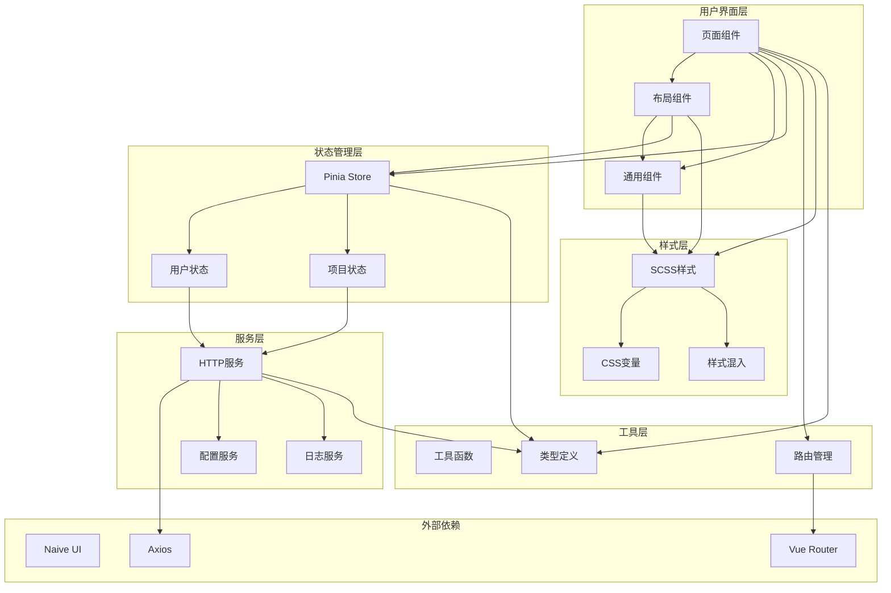
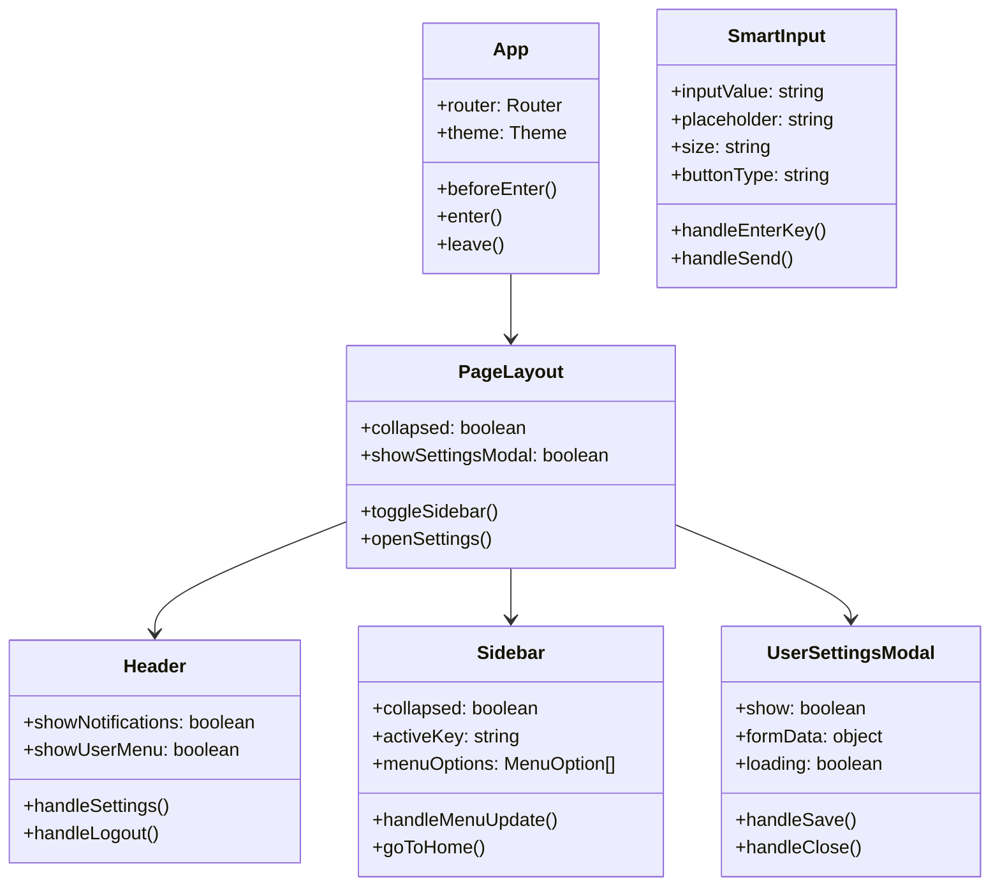
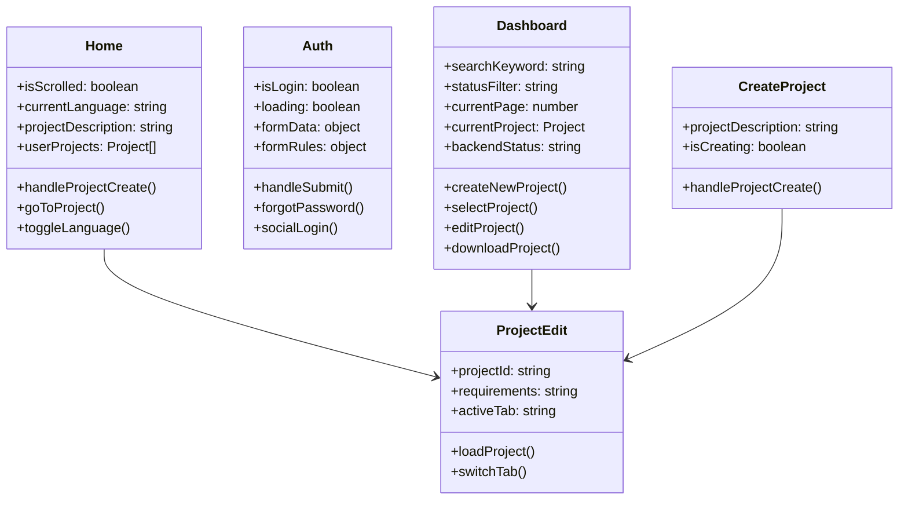
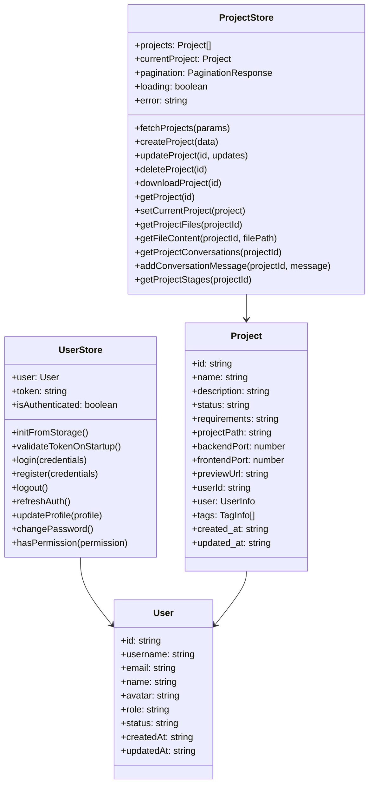
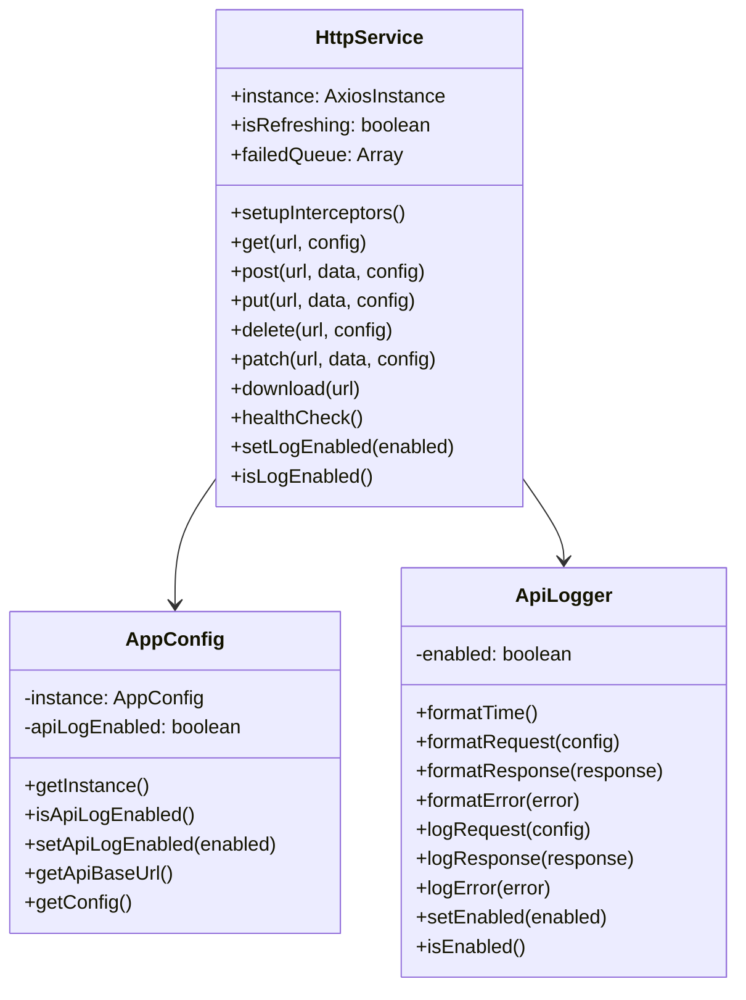
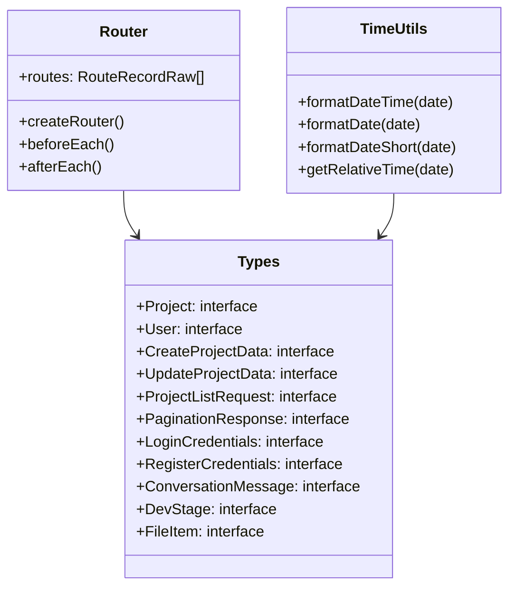
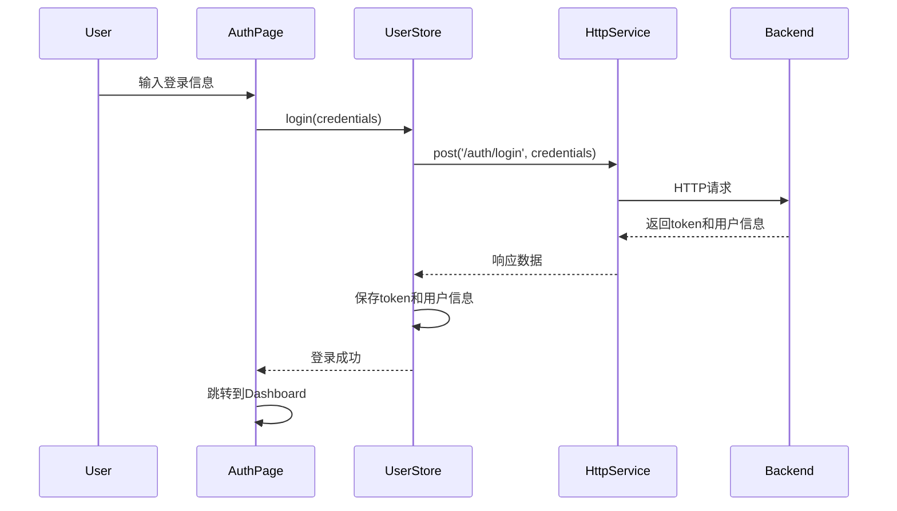
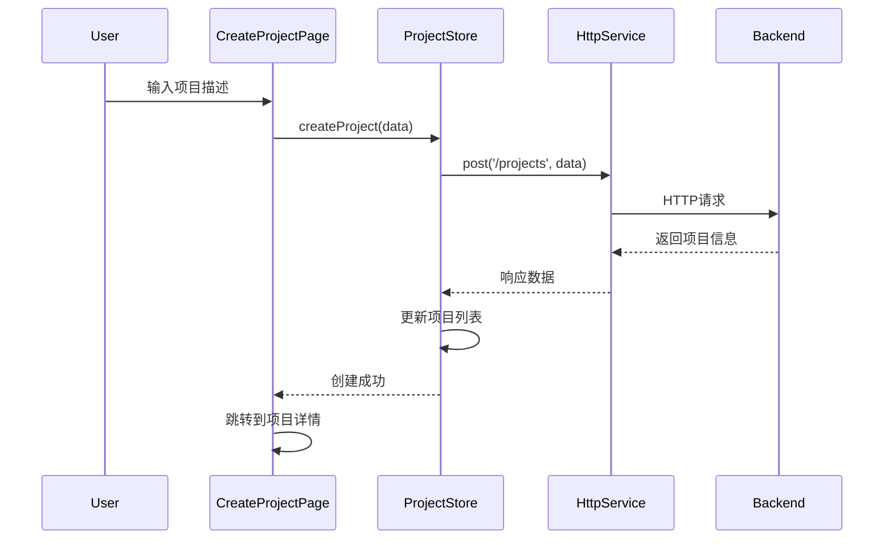
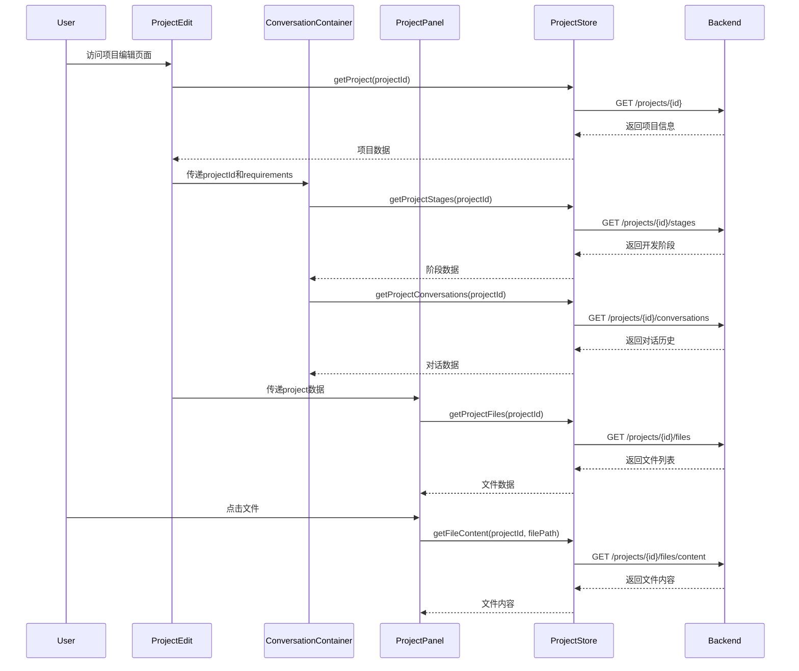

# AutoCodeWeb Frontend Architecture

## 系统架构概览

AutoCodeWeb 前端采用现代化的 Vue 3 + TypeScript + Naive UI 技术栈，结合 Pinia 状态管理和 Axios HTTP 客户端，实现响应式、类型安全的多页面应用。

## 核心架构图



## 详细 UML 类图

### 1. 核心组件层



### 2. 页面组件层



### 3. 状态管理层



### 4. 服务层



### 5. 工具层



## 数据流图

### 用户认证流程



### 项目创建流程



### 项目编辑页面交互流程



## 技术栈说明

### 1. 核心框架
- **Vue 3**: 采用 Composition API，提供更好的类型推导和逻辑复用
- **TypeScript**: 提供类型安全，减少运行时错误
- **Vite**: 快速的构建工具，支持热重载

### 2. UI 框架
- **Naive UI**: 现代化的 Vue 3 UI 组件库
- **SCSS**: CSS 预处理器，支持变量、混入、嵌套等特性

### 3. 状态管理
- **Pinia**: Vue 3 官方推荐的状态管理库
- **响应式设计**: 基于 Vue 3 的响应式系统

### 4. 路由管理
- **Vue Router**: 官方路由管理器
- **路由守卫**: 支持认证和权限控制

### 5. HTTP 客户端
- **Axios**: 基于 Promise 的 HTTP 客户端
- **拦截器**: 支持请求/响应拦截和错误处理
- **自动重试**: 支持 token 刷新和请求重试

## 目录结构说明

```
frontend/src/
├── App.vue                 # 根组件
├── main.ts                 # 应用入口
├── vite-env.d.ts          # Vite 环境类型声明
├── assets/                 # 静态资源
│   └── logo.svg           # 应用Logo
├── components/             # 组件目录
│   ├── common/            # 通用组件
│   │   ├── index.ts       # 组件导出
│   │   └── SmartInput.vue # 智能输入组件
│   ├── layout/            # 布局组件
│   │   ├── Header.vue     # 顶部导航
│   │   ├── PageLayout.vue # 页面布局
│   │   └── Sidebar.vue    # 侧边栏
│   ├── ConversationMessage.vue # 对话消息组件
│   ├── ConversationContainer.vue # 对话容器组件
│   ├── DevStages.vue      # 开发阶段组件
│   ├── ProjectPanel.vue   # 项目面板组件
│   └── UserSettingsModal.vue # 用户设置弹窗
├── pages/                  # 页面组件
│   ├── Auth.vue           # 认证页面
│   ├── CreateProject.vue  # 创建项目页面
│   ├── Dashboard.vue      # 仪表板页面
│   ├── Home.vue           # 首页
│   ├── ProjectEdit.vue     # 项目编辑页面
├── router/                 # 路由配置
│   └── index.ts           # 路由定义
├── stores/                 # 状态管理
│   ├── project.ts         # 项目状态
│   └── user.ts            # 用户状态
├── styles/                 # 样式文件
│   ├── main.scss          # 主样式文件
│   ├── mixins.scss        # SCSS混入
│   └── variables.scss     # CSS变量
├── types/                  # 类型定义
│   ├── project.ts         # 项目相关类型
│   └── user.ts            # 用户相关类型
└── utils/                  # 工具函数
    ├── config.ts          # 配置管理
    ├── http.ts            # HTTP服务
    ├── log.ts             # 日志工具
    └── time.ts            # 时间工具
```

## 开发约束和规范

### 1. 组件开发规范
- **组件命名**: 使用 PascalCase 命名
- **Props 定义**: 使用 TypeScript 接口定义 Props 类型
- **事件命名**: 使用 kebab-case 命名自定义事件
- **样式隔离**: 使用 scoped 样式避免样式污染

### 2. 状态管理规范
- **Store 结构**: 每个功能模块对应一个 Store
- **数据获取**: 通过 Store 的 actions 获取数据
- **状态更新**: 通过 mutations 更新状态
- **类型安全**: 所有 Store 数据都有对应的 TypeScript 类型

### 3. HTTP 请求规范
- **统一封装**: 所有 HTTP 请求通过 HttpService 发送
- **错误处理**: 统一的错误处理和用户提示
- **请求拦截**: 自动添加认证 token
- **响应拦截**: 统一处理响应数据和错误

### 4. 路由管理规范
- **路由守卫**: 使用 beforeEach 进行认证检查
- **懒加载**: 页面组件使用动态导入
- **路由命名**: 使用有意义的 route name

### 5. 样式开发规范
- **CSS 变量**: 使用 CSS 变量定义主题色彩
- **SCSS 混入**: 使用混入定义通用样式
- **响应式设计**: 使用媒体查询适配不同屏幕
- **组件样式**: 每个组件使用独立的 scoped 样式

## 性能优化策略

### 1. 组件优化
- **懒加载**: 路由组件使用动态导入
- **组件缓存**: 使用 keep-alive 缓存组件
- **虚拟滚动**: 大列表使用虚拟滚动

### 2. 状态管理优化
- **数据缓存**: Store 中缓存常用数据
- **按需加载**: 只加载必要的数据
- **状态持久化**: 重要状态保存到 localStorage

### 3. 网络优化
- **请求合并**: 合并多个相关请求
- **请求缓存**: 缓存不经常变化的数据
- **错误重试**: 网络错误自动重试

### 4. 构建优化
- **代码分割**: 按路由分割代码
- **Tree Shaking**: 移除未使用的代码
- **资源压缩**: 压缩 CSS 和 JS 文件

## 安全考虑

### 1. 认证安全
- **Token 管理**: 安全的 token 存储和刷新
- **路由守卫**: 保护需要认证的页面
- **自动登出**: token 过期自动登出

### 2. 数据安全
- **输入验证**: 前端输入验证和过滤
- **XSS 防护**: 防止跨站脚本攻击
- **CSRF 防护**: 使用 CSRF token

### 3. 通信安全
- **HTTPS**: 强制使用 HTTPS 通信
- **请求签名**: 重要请求使用签名验证
- **敏感数据**: 敏感数据不存储在客户端

## 扩展性设计

### 1. 组件扩展
- **组件库**: 基于 Naive UI 扩展自定义组件
- **主题系统**: 支持多主题切换
- **国际化**: 支持多语言切换

### 2. 功能扩展
- **插件系统**: 支持功能插件扩展
- **模块化**: 功能模块独立开发和部署
- **API 扩展**: 支持新的 API 接口

### 3. 部署扩展
- **多环境**: 支持开发、测试、生产环境
- **CDN 部署**: 静态资源使用 CDN 加速
- **容器化**: 支持 Docker 容器化部署
